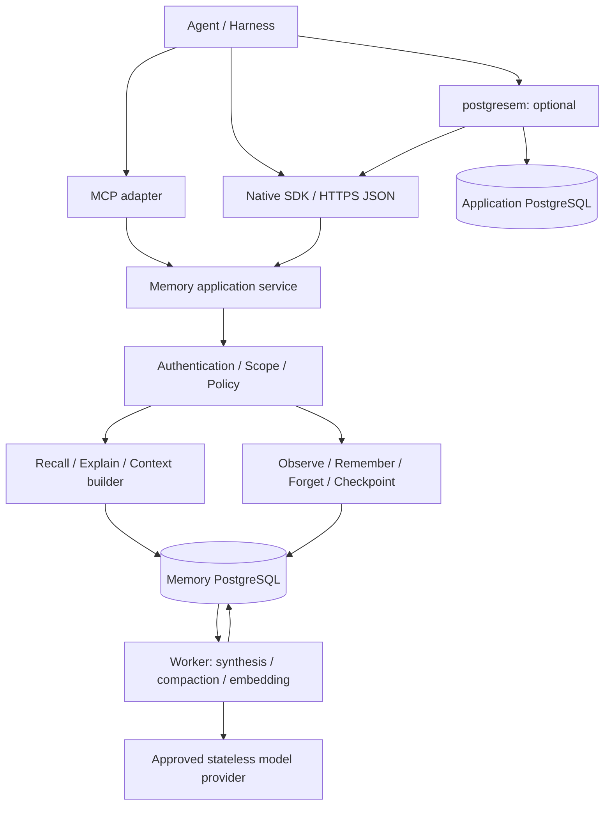

# pg_agmemory 実装プラン

[English](PG_AGMEMORY_IMPLEMENTATION_PLAN.md) | 日本語

- 文書版: 1.14 / M5 新しい置換standby、2026-09-24
- 作成日・原案に記載された外部仕様の確認日: 2026-09-16。本改訂・翻訳で外部仕様やversionの再確認は行っていない。
- 状態: M5開発を0.4.0.dev1/APIv1/schema22で継続し、revision遅延検査の再走査削減、COMMIT結果guard、運用/複製観測、paused SQL-only PITR、所有primaryのfencingを確認するHA rehearsalを追加。同期待機cancelをrollbackや複製成功とは扱わないが、本番HAとpartitionの認定は残る。公開済みM4 v0.3.0とa869629のnative/復元/資源証跡は変更せず、SQL既定・修正AGE72707aa opt-inを維持する。[STATUS](STATUS-jp.md)と[EVALUATION](EVALUATION-jp.md)を参照。
- 対象: PostgreSQLを唯一のアプリケーション永続基盤とする、独立したOSS Agent Memory Service
- 起点: 「LLMエージェント記憶実装説明」の会話。既存製品の内部実装を再現するものではない。

### 過去のM4実装経過

M4は任意LangGraph 1.2.11 safe-boundary pilotから開始します。
[運用契約](operations/README-jp.md#m4-langgraph-safe-boundary-pilot)を参照してください。
この連携のGraph APIは再確認しましたが、無関係な過去の外部仕様は再確認していません。
任意scheduler永続化ではなく、Nativeの型付きcheckpointを明示利用します。
外部sourceの失効/freshnessと残る統合受入れは未完です。
続く外部source incrementはversion付き履歴snapshot envelopeをNative SDKで保存し、
business queryとcaptureの結果を分離して、
専用scope readerの期限/失効とprovenance削除を確認します。
DB metadata indexや上流connectorは追加しません。
信頼する認可/通知coordinatorとdataset全体のtarget発見は未完で、
shared business dataの自動長期保存は無効に保ちます。
[source profile](operations/README-jp.md#m4-external-source-snapshot-pilot)を参照してください。
続く**0.3.0.dev1/schema21**では、管理者専用の永続source binding/通知cursor、
read-only leaseの原子的適用、重複/欠落制御、source削除のterminal拒否を追加します。
復元はsource state/historyの完全一致を要求し、旧backupへ変更済みauthorityを取り込みません。
実際の上流認証器/通知transport、dataset全体のmapping、統合受入れ全体は未完です。
[coordinator契約](operations/README-jp.md#m4-durable-source-access-coordinator)を参照してください。
この開発versionはv0.3 releaseではなく、M4完了も宣言しません。
続くschema維持incrementで、登録済みdataset readerの限定発見と原子的な緊急失効を追加します。
対象集合digestとepochのCASを要求し、source通知番号の消費、
将来のbinding/allowの禁止、payload purgeは行いません。
完全なsource-to-memory mapping、datasetのterminal削除、認証済み通知transportは未完です。
[登録済みreader](operations/README-jp.md#registered-dataset-readers)を参照してください。
署名付き通知incrementは、operator所有の固定signer/source/reader profileで
local RS256 deliveryを認証してからcoordinatorへ渡します。
署名、identity完全一致、閉じたclaim、配送期限を確認しますが、
上流serviceの実ACL状態を独立照会するものではありません。
network配送、remote鍵、自動retry、新schemaは追加せず、
shared business dataの自動長期保存には実connectorと配送/削除連携が必要です。
[署名付き通知](operations/README-jp.md#signed-source-notice-receiver)を参照してください。

## 1. 採用方針

**エージェント＋LLMが利用できる、信頼できる記憶システムをPostgreSQLで提供する。「判断」システムにはしない。** Native Memory APIは記憶の構造・根拠参照・時間・権限・lifecycleを管理する。MCPは外部エージェント向けadapter、postgresemは任意の統合先とする。入力は`observe`で記録し、明示許可された背景処理がmodelの提案を取得できる。`recall`は構造化データと予算内のcontext packを返し、正しさを認定した回答を返すものではない。

永続データの正本はPostgreSQLの通常テーブルに置く。JSONBは可変の内容・実行状態、pgvectorの`vector`は意味検索、Apache AGEまたはSQL/PGQは関係探索に使う。グラフに権限・時間・根拠の唯一の正本を持たせない。

| 項目 | 決定 |
|---|---|
| 最小構成 | Memory APIプロセス、workerプロセス、PostgreSQL。APIとworkerは同じコードベース |
| 永続化 | episode、assertion、entity、relation、checkpoint、job、監査、削除記録をすべてPostgreSQLへ |
| 正式API | HTTPS + JSON + OpenAPI / JSON Schema。DBの表構造やSQLを公開しない |
| 検索 | 権限・時間の制約下で全文検索、vector、構造化検索を統合。後から限定的graph expansionを追加 |
| グラフ採用 | PostgreSQL 18 + AGE 1.7系を第一検証候補。PostgreSQL 19 SQL/PGQは並行評価後に昇格 |
| MVP | M1で安全な最小縦断、M2で運用可能なcore MVP、M3でAGEを含むgraph MVPを完成 |
| postgresem連携 | 認証委譲とMemory APIで接続。業務DBへの記憶の書込み、共有DB資格情報を前提にしない |
| 分離 | 常に論理分離。本番の既定は業務DB／semantic catalogとMemory DBの別クラスタ化 |

### 1.1 「PostgreSQLのみ」の範囲

Redis、Kafka、外部vector DB、Neo4j、SQLite、ファイルベースのmemory indexを必須にしない。永続queue、再試行状態、dedup、job lease、context packを保存する場合のキャッシュもPostgreSQLに置く。メモリ上の一時cacheは許可するが、再起動で正しさを失わない。

推論・embedding・rerankingはDB外のstatelessプロセス、ローカルモデル、または許可されたモデルAPIで実行できる。「PostgreSQL内で全推論を行う」という意味ではない。モデルAPIへの送信先・データ保持条件はtenant policyで制限し、送信禁止環境にはローカルproviderを用意する。外部モデルやIAMの管理情報はサービス運営上の依存であり、pg_agmemoryの記憶の正本にはしない。

原資料の最小限の許可済みsnapshotもPostgreSQLへ保存する。外部URIは出典参照であり、記憶の復元に必須の外部blob storeにしない。MVPでは画像・動画・大容量添付の保管を対象外にする。

バックアップ、WAL archive、レプリカはPostgreSQLの運用用複製として別媒体に保存する。これらまで同一DB内に閉じ込めることは障害復旧にならない。永続metrics／auditもPostgreSQLを標準とし、外部監視製品へのexportは任意とする。

### 1.2 非目標

- ChatGPTなどの非公開メモリ実装や非公開プロトコルの再現。
- 自律的な業務実行エンジン、外部副作用のexactly-once保証、モデル学習基盤。
- model順位表、複数modelの品質比較、自動的な最適model選択、生成内容の意味的正しさや利用agentのtask成功の保証。
- 全会話の無条件保存、LLMによる任意SQL/Cypher、任意schema変更。
- MVP時点の分散DB、tenant横断の知識共有、任意長graph traversal、マルチモーダル記憶。
- 記憶だけで業務DBの現在値を保証すること。現在値を要求された場合は出典へ再照会する。

### 1.3 責務の境界と評価範囲

ユーザー/operatorが予算と用途に応じ、generation、embedding、対応する場合は
rerankのmodel/providerを指定する。意味の解釈や重要度の判断は、それらの部品または
callerの責務である。役割ごとに異なるmodelを使えてよいが、その比較研究は目的ではない。
明示的な構造化記憶と決定的検索はgenerationなしでも利用できるものとする。
固定ranking、時点filter、ACL、retention、公開policyはソフトウェアの規則であり、
LLMへ判断を委ねない。

| 担当 | 責務 |
|---|---|
| pg_agmemory | データ/API契約の検証、原子的保存、根拠・版の関係、認可付き検索、CAS、削除、復旧、予算、provider呼出し会計 |
| 指定model/providerまたはcaller | 抽出、自然言語要約、embedding、任意の意味的rerank。権限付与・承認の捏造・記憶契約の迂回は許可しない |
| ユーザー/operator | model選択、明示的な処理/公開policy、資料の利用許可、配置設定 |
| プロジェクトのbenchmark | 一つの固定した参照構成による実際の保存・検索・圧縮・復元の例と限界。model比較や意味的品質認定ではない |

modelを指定できることは、任意protocol・次元への互換性保証ではない。
M2は明示したgeneration/embedding契約を検証し、未対応設定を拒否する。
現行background workerはlocal専用、vectorは768次元固定である。
本計画はremote workerを有効化せず、rerankerの実装済みも意味しない。
任意のrerank adapterは具体的な後続連携要求（M4）、追加embedding空間と移行はM5で扱う。
互換性は制御したprovider応答と一つのlive参照構成で検証し、model別スコア表を作らない。
良い結果を得るための無断provider切替や送信範囲の拡大を禁止する。

**2026-09-19の決定:** 意味的assertion precision 95%、重要claim保持98%、
自然言語更新95%、根拠なし回答2%、実agent task 20件・成功率低下2 percentage points以内は、
M2以降の完了gateから外す。合格扱いにも、別の必須作業への移管にもしない。
任意の意味的観測は正確に区別して報告するが、大規模な人手注釈・複数model比較は対象外。
再現可能な一つの参考benchmarkは成果物として残し、model品質の合格点は設けない。
旧dataset上のRecall@20 90%以上/vector baseline以上、nDCG/MRR非劣化も参考結果とし、
普遍的なmodel品質保証にはしない。検索実装の契約への一致は引き続き必須である。
17–18章は過去の証跡・ADRにあるmilestone/品質gateの記述に優先する。
認可、決定的な正しさ、復旧、資源上限の要件は緩和しない。

## 2. 現行技術の確認と設計への反映

参照会話の製品説明は設計上の着想として扱い、公開仕様の確認と分ける。以下は確認日時点の情報であり、M0と各リリース前にtag・checksum・対象PostgreSQL majorを再確認する。

| 技術 | 確認した事実 | 本計画での扱い |
|---|---|---|
| PostgreSQL | 公式資料は18を現行supported版、19をdevelopment版として掲載。19のrelease notesにSQL/PGQが記載されている | SQL/PGQを既存安定版の標準機能と仮定しない。[公式release notes](https://www.postgresql.org/docs/19/release-19.html) |
| SQL/PGQ | PostgreSQL 19のproperty graph資料が公開されている | AGE互換とみなさず、使う構文・RLS・実行計画を個別に検証。[公式property graph資料](https://www.postgresql.org/docs/19/ddl-property-graphs.html) |
| Apache AGE | 公式downloadページはPG18向け1.7.0を掲載。release notesはRLS support追加を記載する一方、リンク先tag名にはrc表記がある | 配布物と対応majorを固定し、RLS実証を採用条件にする。[downloads](https://age.apache.org/download/)、[release notes](https://age.apache.org/release-notes/) |
| pgvector | exact/approximate search、HNSW、iterative scanを提供。ANNでのfilterは候補不足を起こし得る | exact検索をoracleにし、権限制約の強い場合のrecallを測定する。[公式README](https://github.com/pgvector/pgvector) |
| MCP | 2026-07-28仕様ではstateless coreへの変更が公表されている | native sessionとMCP transportを分離。client対応版を契約テストで固定する。[仕様更新](https://blog.modelcontextprotocol.io/posts/2026-07-28/) |

### 2.1 既存設計から取り入れる点

| 参照実装 | 取り入れる考え方 | pg_agmemoryで追加する境界 |
|---|---|---|
| [Mem0](https://github.com/mem0ai/mem0) | 会話から有用な長期記憶を抽出・検索する | extractionと事実認定を分離し、根拠・削除伝播を必須化 |
| [Letta memory blocks](https://www.letta.com/blog/memory-blocks/) | 更新可能な作業用memory blockと背景処理 | blockを実行checkpointや恒久的な事実と混同しない |
| [Graphiti](https://github.com/getzep/graphiti) | episode由来の時間変化する関係、hybrid retrieval | PostgreSQL内に正本を置き、graph adapterを交換可能にする |
| [LangGraph persistence](https://docs.langchain.com/oss/python/langgraph/persistence) | thread実行状態のcheckpointと長期memoryの分離 | 特定harness非依存のcheckpoint envelopeと復旧条件を定義 |

これらの組合せを「最新設計」と位置づける。特定OSSのbenchmark値を本サービスの性能予測には使わず、機能やlicenseの全面互換も約束しない。

## 3. アーキテクチャと配置



この図の分割は責務であり、初期から個別microservice化する指示ではない。core、API、worker、adapterをモジュールとして実装し、プロセスはAPIとworkerの二つに留める。

### 3.1 論理分離と物理分離

| 配置 | 用途 | 境界と限界 |
|---|---|---|
| 同一DB、別schema/role | 開発・小規模pilot | `memory`、`memory_ops`、`memory_graph`を分離。CPU、I/O、WAL、backupは共有 |
| 同一cluster、別database | 過渡期 | 接続・schema・migrationを分離できるが、障害・資源・WAL負荷は共有 |
| 別PostgreSQL cluster | 本番の既定 | 業務queryとembedding、compaction、vacuum、retention処理の資源・復旧周期を分離 |
| tenant専用cluster | 強い隔離・特別な保持条件 | 運用費とmigration負荷が増加。一般tenantの既定にはしない |

論理的な統合とは、共通identity、policy、API discovery、source provenanceを共有することを指す。物理的な同居は必要条件ではない。Memory DBと業務DBを跨ぐACID transactionや外部キーは設けない。

### 3.2 最初の技術選択

実装候補はPython + 型付きschema validation + ASGI HTTP + psycopg、migrationはSQL中心とする。M0で維持状況・license・MCP SDK対応を確認してADR化する。高負荷箇所を計測する前にRustへの全面移植は行わない。OpenAPIからTypeScript clientも生成できる構成にする。

PostgreSQL 18のセキュリティ修正版、pgvector 0.8以降の検証済み版を基本profileとする。AGE有効profileは別CI jobで構築し、配布artifactを固定する。PostgreSQL 19 development profileはSQL/PGQ実験専用とし、coreの互換要件には含めない。

## 4. メモリの意味モデル

| 種類 | 保持するもの | 書込み・更新 | 主な寿命 |
|---|---|---|---|
| Working | 現在のgoal、制約、進捗、判断、未解決事項、次のaction、参照ID | harnessがrevision付きで更新。compactionで再構成 | task/session単位、TTLあり |
| Episodic | 発言、tool結果、観測、承認などの出来事と順序 | `observe`による追記。訂正は別event | policy別retention |
| Semantic | preference、decision、entity、検証結果などのassertion | explicit記憶またはsynthesis。訂正・無効化はrevision化 | 根拠、用途、鮮度に依存 |
| Temporal | いつ成立していたか、いつ知ったか、どの情報に置換されたか | assertion/relationの二時点履歴として管理 | 意味的履歴の保持期間 |

Temporal memoryを独立した重複ストアにはしない。working snapshotやepisodeにも時刻はあるが、二時点での事実照会はassertion/relationが担う。procedural memoryは将来の`procedure`種別とし、自動実行可能な命令には昇格させない。

### 4.1 共通の不変条件

1. すべての記憶・派生物・job・checkpointはtenantに属する。tenant境界を跨ぐ参照はDB制約で拒否する。
2. 記憶の本文は信頼できる指示ではない。retrieved textでsystem policy、権限、tool permissionを変更しない。
3. 公開するassertionには少なくとも一つの許可済み根拠を要求する。LLM出力のみを外界の事実の根拠にしない。
4. 類似度、重要度、confidence、鮮度、source authorityは別値。vector類似度をconfidenceと呼ばない。
5. 未知、推定、矛盾、失効、削除を区別する。「見つからない」を「存在しない」という事実にしない。
6. TTLやアクセス頻度だけで事実の真偽を変更しない。期限切れは利用不可または要再検証である。
7. forget/ACL変更後の再処理で、消した情報や広いアクセス権を復活させない。

### 4.2 Assertionとconfidence

assertionは`subject + predicate + object + qualifiers + valid_time + epistemic_status`を中心にする。objectはliteral JSONBまたはentity参照。predicateごとに型、単値／複数値、時間粒度、変更ルールを登録する。

`epistemic_status`は`reported / inferred / verified / disputed / retracted`を使う。例えば「ユーザーがXと言った」というepisodeは直接観測でも、「Xが真実である」は通常`reported`である。明示的な`remember`は保存意図を示すもので、confidence=1にはしない。

confidenceには`score: 0..1 or null`、`method`、`calibration_version`を持たせる。LLM自己申告値は別の`extraction_score`に隔離する。未校正値は確率ではなく、nullを許可してsource classと根拠数を表示する。校正を主張する場合は外部から与えた方法/証跡を識別し、プロジェクトでmodel校正研究は行わない。転載やsummary再取込みを独立証拠として加点しない。

### 4.3 二時点とsupersession

- `valid_time`: 実世界で成立すると主張する期間。`tstzrange`で`[from, to)`。
- `system_time`: そのrevisionをサービスが採用していた期間。サーバーが設定し、callerは過去へ書き換えられない。
- `occurred_at`: episodeで出来事が発生した時刻。`recorded_at`と分離する。
- `as_of`: valid timeの照会点、`known_at`: system timeの照会点。既定はいずれも現在。

例: 9月10日に「契約Goldが9月1日から有効」と知り、9月16日に「実際は9月5日から」と訂正された場合、9月3日について`known_at=9月12日`ではGold、`known_at=9月16日訂正後`ではGoldの根拠なしと返せる。履歴を単純な本文上書きで破壊しない。

同一assertionの内容訂正はrevision追加、別のassertionによる置換は`supersession` edgeで記録する。edgeは`reason`、`effective_valid_time`、採用system time、actor、根拠を持ち、分岐も許す。新旧が衝突しても、追加時刻が新しいだけで勝者にしない。

単値predicateの変更は`tenant + scope + subject + predicate + qualifiers_key`のfact keyでtransaction lockを取り、expected revisionを確認し、旧revisionのsystem rangeを閉じ、新revision／必要な期間分割を同じtransactionで登録する。未来の変更、遡及訂正、不確実な日付、複数値predicateを別ケースで扱う。未知の開始日を勝手に観測日に補完しない。

`superseded`を全時点に対する除外条件にしてはいけない。過去照会では、指定時点のrevisionとsupersession有効期間を評価する。一方、現在の削除・権限失効は`known_at`を過去にしても回避できない。

## 5. PostgreSQLのデータモデル

### 5.1 Schemaと主要テーブル

以下は実装対象の論理schema。`tenant_id`を含む複合主キー／外部キーを原則とし、制御列は通常列、柔軟な本文だけをJSONBにする。

| schema.table | 主な列・制約 | 役割 |
|---|---|---|
| `memory.tenant` | id、policy_revision、access_epoch、deletion_epoch | 境界・失効世代 |
| `memory.principal` | tenant、id、kind、external_subject | user/agent/service identityの対応 |
| `memory.scope` | tenant、id、kind、owner、parent_id、retention_policy | user/agent/project/task/sessionの範囲 |
| `memory.scope_member` | tenant、scope、principal、permissions、expiry | `read/write/delete/admin`を別管理 |
| `memory.object` | tenant、id、kind、scope、created_at、expires_at、deleted_at | 共通の認可・削除anchor |
| `memory.episode` | object FK、source_event_id、stream_id、sequence、occurred_at、payload JSONB | 入力event。source内sequenceとevent IDで重複抑止 |
| `memory.entity` | object FK、type、canonical_label | 人・組織・projectなど。aliasは別table |
| `memory.entity_alias` | tenant、scope、namespace、normalized_value、entity FK | entity候補の解決。名前だけで全tenant結合しない |
| `memory.assertion` | object FK、subject FK、predicate、qualifiers_key | 安定したassertion ID |
| `memory.assertion_revision` | tenant、assertion、revision、object JSONB/entity FK、valid_time、system_time、status、confidence | 二時点の本文 |
| `memory.relation` | object FK、from_entity、to_entity、predicate、assertion/revision FK | assertionに裏付けられたtyped edge。時間・真偽をassertionから取得 |
| `memory.derivation` | object FK、recipe/model/prompt/schema version、input digest、job FK | synthesisの再現情報 |
| `memory.provenance_edge` | tenant、child object+revision、parent object+revision、relation、source span | depends_on/supports/contradicts/summarizes。削除伝播用の逆索引 |
| `memory.supersession` | tenant、old/new assertion FK、reason、effective range、recorded_at | 置換・訂正の履歴 |
| `memory.working_snapshot` | object FK、run/branch、revision、state JSONB、covered_sequence | 再開に必要な作業context |
| `memory.checkpoint` | object FK、run/branch、sequence、parent、state JSONB、schema_version、checksum | harnessの実行状態。working snapshotへの参照 |
| `memory.tool_effect` | tenant、run、operation_id、idempotency_key、status、receipt | 外部副作用の照合。秘密を含む生tool payloadは保存しない |
| `memory.chunk` | object FK、source object+revision、ordinal、text、token_count、tsvector | episode/assertion/summaryの検索単位 |
| `memory.embedding` | tenant、chunk FK、model_revision、vector、input_digest | embeddingの再生成可能なprojection |
| `memory_ops.job` | tenant、kind、dedup_key、input_revision、state、lease_token、lease_until、attempt | durable queue |
| `memory_ops.idempotency` | tenant、principal、operation、key、request_hash、result_ref、expiry | mutationの再送契約 |
| `memory_ops.deletion_request` | tenant、selector、state、cutoff、epoch、counts、retention_deadline | forgetの進捗と再生防止 |
| `memory_ops.audit_event` | tenant、actor、action、対象opaque ID、outcome、時刻 | 本文を含めない監査 |
| `memory_ops.graph_projection` | tenant、graph backend、input watermark、generation、status | AGE投影の進捗・再構築 |

`object`の子tableはkind整合性をconstraint triggerなどで保証する。revisionを持つobjectの参照は、object IDだけでなくrevisionまたは不変payload IDも保持する。graph、embedding、summaryから元の根拠へ戻れる構造にする。provenanceは循環禁止で、最大深さと入力数を制限する。

### 5.2 中核DDLの形

以下は型・鍵・期間制約の具体例であり、完成したmigrationではない。権限policy、kind trigger、削除時の履歴処理、全tableの外部キー、role/grantはM0/M1で一体実装する。初期検証用embedding次元は768に固定するが、特定providerの採用を意味しない。

```sql
CREATE EXTENSION IF NOT EXISTS vector;
CREATE EXTENSION IF NOT EXISTS btree_gist;
CREATE SCHEMA memory;

CREATE TABLE memory.scope (
    tenant_id uuid NOT NULL,
    id uuid NOT NULL,
    kind text NOT NULL CHECK (kind IN ('user','agent','project','task','session')),
    policy_revision bigint NOT NULL DEFAULT 1,
    PRIMARY KEY (tenant_id, id)
);

CREATE TABLE memory.object (
    tenant_id uuid NOT NULL,
    id uuid NOT NULL,
    scope_id uuid NOT NULL,
    kind text NOT NULL,
    created_at timestamptz NOT NULL DEFAULT transaction_timestamp(),
    expires_at timestamptz,
    deleted_at timestamptz,
    PRIMARY KEY (tenant_id, id),
    FOREIGN KEY (tenant_id, scope_id) REFERENCES memory.scope (tenant_id, id)
);

CREATE TABLE memory.assertion (
    tenant_id uuid NOT NULL,
    id uuid NOT NULL,
    subject_id uuid NOT NULL,
    predicate text NOT NULL,
    qualifiers_key text NOT NULL,
    PRIMARY KEY (tenant_id, id),
    FOREIGN KEY (tenant_id, id) REFERENCES memory.object (tenant_id, id),
    FOREIGN KEY (tenant_id, subject_id) REFERENCES memory.object (tenant_id, id)
);

CREATE TABLE memory.assertion_revision (
    tenant_id uuid NOT NULL,
    assertion_id uuid NOT NULL,
    revision bigint NOT NULL CHECK (revision > 0),
    value jsonb NOT NULL,
    valid_time tstzrange NOT NULL CHECK (NOT isempty(valid_time)),
    system_time tstzrange NOT NULL CHECK (NOT isempty(system_time)),
    epistemic_status text NOT NULL CHECK
      (epistemic_status IN ('reported','inferred','verified','disputed','retracted')),
    confidence double precision CHECK (confidence BETWEEN 0 AND 1),
    confidence_method text,
    PRIMARY KEY (tenant_id, assertion_id, revision),
    FOREIGN KEY (tenant_id, assertion_id)
      REFERENCES memory.assertion (tenant_id, id),
    EXCLUDE USING gist
      (tenant_id WITH =, assertion_id WITH =, system_time WITH &&)
);

CREATE TABLE memory.chunk (
    tenant_id uuid NOT NULL,
    id uuid NOT NULL,
    source_id uuid NOT NULL,
    source_revision bigint NOT NULL,
    body text NOT NULL,
    search_text tsvector NOT NULL,
    PRIMARY KEY (tenant_id, id),
    FOREIGN KEY (tenant_id, id) REFERENCES memory.object (tenant_id, id),
    FOREIGN KEY (tenant_id, source_id) REFERENCES memory.object (tenant_id, id)
);

CREATE TABLE memory.embedding (
    tenant_id uuid NOT NULL,
    chunk_id uuid NOT NULL,
    model_revision text NOT NULL,
    input_digest text NOT NULL,
    embedding vector(768) NOT NULL,
    PRIMARY KEY (tenant_id, chunk_id, model_revision),
    FOREIGN KEY (tenant_id, chunk_id) REFERENCES memory.chunk (tenant_id, id)
);

CREATE INDEX chunk_fts ON memory.chunk USING gin (search_text);
CREATE INDEX object_scope ON memory.object (tenant_id, scope_id, created_at);
CREATE INDEX assertion_valid ON memory.assertion_revision USING gist (valid_time);
```

同一assertionのsystem期間は重複禁止とするが、異なるassertion同士の矛盾は保存可能とする。単値predicateの採用決定はfact keyをlockして行う。期間端点の`[)`統一、下限必須のsystem time、tenant FK、entity型の検査などをmigration完成条件に含める。例の`source_revision`は型ごとの不変revision参照への制約を別途必要とする。

### 5.3 Index・embedding・日本語

- B-tree: tenant/scope/time、source event dedup、job state/available_at、provenanceの親側・子側。
- GIN: `tsvector`と実際に検索するJSONB属性。すべてのJSONBに無条件GINを作らない。
- GiST: valid/system range。長期episodeの時系列scanは量を測ってBRIN・月partitionを検討。
- HNSW: model revisionごとに専用table/partitionまたは固定predicateのpartial indexを作る。同じ次元でも異なるmodel空間を混在させない。
- embeddingはmodel ID、revision、dimensions、distance metric、normalization、input digestを記録する。M5の移行では空間を分離し、coverage、参照整合性、query空間互換性、rollback検査の合格後にoperator明示承認で切り替える。model品質順位を切替条件にしない。
- PostgreSQL標準全文検索をBM25と呼ばない。日本語はアプリ側の固定version tokenizerで分かち書きして`tsvector`化し、queryにも同じ処理を使う。英語、日本語、ID・固有名詞を別評価する。

ANNのfilterで結果数が不足するときは、iterative scan、許可範囲のexact検索、tenant別index配置を順に評価する。HNSWの`vector`は2,000次元までというindex側制限もあるため、大きな次元への変更は型とindexを再設計する。[pgvector filtering・index仕様](https://github.com/pgvector/pgvector)

## 6. 認証・scope・ACL

### 6.1 Identityの信頼境界

HTTPではOIDC/OAuth tokenの署名、issuer、audience、有効期限を検証し、server側のmappingからtenant、user、agent、delegation、capabilityを確定する。bodyの`tenant_id`や`user_id`でidentityを変更させない。`scope_ids`と`purpose`はcallerから指定可能だが、認可された範囲を狭める条件としてのみ使う。

scopeの親子関係は整理のためであり、自動的なアクセス権の継承を意味しない。agentが複数userを代理する場合も毎requestでdelegationを検証する。削除、共有、synthesis有効化は独立権限にする。MVPは明示的scope membership方式とし、複雑な任意ACL式のDSLは導入しない。

### 6.2 DB強制とサービス責務

すべての内容tableと派生tableにRLSを適用し、runtime roleはowner、superuser、`BYPASSRLS`を禁止する。table ownerには必要に応じて`FORCE ROW LEVEL SECURITY`を適用する。PostgreSQLではowner等の例外があるため、通常userだけでの試験では不十分である。[公式RLS資料](https://www.postgresql.org/docs/18/ddl-rowsecurity.html)

認証済みrequest contextは短いtransaction内で`SET LOCAL`相当のparameterized設定を行い、commit/rollback後にpoolへ返す。custom GUC自体に改竄耐性はない。これを安全性の根拠にせず、DB資格情報をサービス専用にし、自由SQL入口を排除し、固定queryだけを実行する。サービス侵害まで隔離する要件にはtenant専用role/DBを採用する。

RLS helperはtrusted context、scope membership、object状態、期限、依存するsourceの可視性を検査する。helper内部の再帰policy、`SECURITY DEFINER`、`search_path`、public EXECUTEを監査する。workerにもtenant/scopeを限定したjob contextを渡し、通常処理に全tenantを読む資格情報を与えない。

### 6.3 派生物からの漏洩を防ぐ

複数sourceから作るsummary/assertionの可視性は、必要な全入力の可視性の積集合を超えない。MVPでは同一scope・同一policy domain内だけでsynthesisする。cross-scope統合はM4以降で、依存sourceの認可を毎回評価できる場合に限る。

source ACL変更は`access_epoch`を進める。検索結果だけでなく、要約、embedding、entity名、graph中間node、explain、checkpoint、context cacheの利用可否を再評価する。非公開nodeを通ったpathによる「存在推測」も返さない。見えないsourceを落としただけのsummary本文は返さず、再生成完了まで非公開にする。

認可失敗ではIDの存在を明かさない共通404形式を用いる。件数・ranking理由・timingからの漏洩を攻撃テストに含める。強いtiming隔離は共有ANN indexで保証できないため、必要なtenantは物理分離する。

## 7. Native Memory API

### 7.1 共通契約

`/v1`をcanonical interfaceとし、OpenAPI・JSON Schema・error catalogを版管理する。認証contextはbodyから独立する。すべてのmutationに`Idempotency-Key`、競合し得る更新に`expected_revision`または`If-Match`を要求する。

同じkey・同じrequest hashなら同じ結果参照を返し、異なるpayloadなら409とする。idempotency記録はmutationと同じDB transactionに保存する。応答本文を保存する場合は最小限にし、forget完了後の再送で削除済み本文を返さない。keyの保持期間を契約に明記し、長期のepisode重複はsource event IDの一意制約でも防ぐ。

| API | 入力の中心 | 応答・意味 |
|---|---|---|
| `POST /v1/observe` | scope、source event ID、occurred_at、content、source metadata、consent reference | 201: durableなepisode ID、ingest revision、synthesis job ID。記憶抽出完了は意味しない |
| `POST /v1/remember` | scope、構造化assertionまたはtext、explicit intent、根拠、retention request | 構造化入力は同期検査後201。自然文抽出は202とjob ID。`reported/inferred`を明示 |
| `POST /v1/recall` | query、scope、purpose、as_of、known_at、budget、consistency | 200: structured items、context pack、coverage・鮮度・trace metadata |
| `POST /v1/explain` | memory ID + revision、またはrecall trace ID | 200: 可視な根拠、変遷、採用・ranking理由、model/policy version |
| `POST /v1/forget` | 明示IDまたは厳密なselector、mode、reason | 202: read barrierがcommit済みのdeletion receiptとpurge job。preview modeは変更しない |
| `POST /v1/supersede` | old IDs/revisions、new assertion、effective interval、reason、根拠 | 201/409: transaction単位の訂正。通常LLM向けには公開しない |
| `POST /v1/checkpoints` | run、branch、parent、expected head、typed state | 201/409: immutable checkpointと新head |
| `POST /v1/checkpoints/restore` | checkpoint ID、target branch、harness version | 再認可後の復旧envelope。外部副作用は自動再実行しない |
| `GET /v1/jobs/{id}` | job ID | pending/running/succeeded/failed、watermark、安全なerror |
| `GET /v1/deletions/{id}` | receipt ID | block/purge/replica/backup期限を分離した進捗 |
| `GET /v1/capabilities` | 認証context | API/schema版、graph backend、tokenizer、利用可能機能・上限 |

body size、batch size、query長、token数、graph hops、job頻度には上限を設ける。初期値はobserve 256 KiB、checkpoint 1 MiB、implicit context 2,000 tokens、explicit 8,000 tokens、graph 2 hops/200 nodesとし、負荷試験で変更する。超過は暗黙切捨てではなく413/422または明示的`truncated`で返す。

400=構文、401=未認証、403=操作権限、404=対象非公開/不存在、409=revision/idempotency競合、422=意味・予算不正、429=quota、503=依存停止とする。errorは`code, request_id, retryable, details`を持ち、本文や他tenantの識別子を含めない。

### 7.2 Observe / rememberの保存方針

`observe`は何でも保存する入口ではない。harnessがtenantのcapture policy、user consent、secret/PII除去、保存禁止sourceを検査した後に呼ぶ。サービス側でも再検査する。全文が不要ならtool outcome、時刻、source ID、digestだけを記録する。

`remember(explicit)`はuserが保存を希望したことを別fieldに残す。保存禁止dataの例外や共有範囲拡大には使えない。自然文は原文episodeを保存してから抽出し、抽出pendingでも原文をrecallできる。tenantの`auto_synthesis`が無効なら、observeを長期assertionへ自動昇格させない。

### 7.3 Recall request例

```json
{
  "query": "ACMEの現在の契約プランと、変更理由を教えて",
  "scope_ids": ["project-acme"],
  "purpose": "customer_support",
  "mode": "explicit",
  "as_of": "2026-09-16T12:00:00+09:00",
  "known_at": "2026-09-16T12:00:00+09:00",
  "token_budget": 3000,
  "tokenizer_id": "configured-answer-model-v1",
  "include_evidence": true,
  "consistency": {"mode": "read_your_writes", "after_ingest": "ingest-1842"},
  "limits": {"max_items": 20, "max_hops": 2}
}
```

IDは読みやすくした例示値。実装ではschemaに定義したopaque IDを使う。`after_ingest`はtenant/scopeに束縛したtokenであり、全tenantのLSNやevent数を公開しない。read-your-writesは原文episodeの可視性を保証し、背景抽出の完了までは保証しない。抽出の待合せはjob APIとdeadlineで別指定する。

### 7.4 Recall response例

```json
{
  "request_id": "req-742",
  "items": [
    {
      "memory_id": "assertion-81",
      "revision": 3,
      "type": "assertion",
      "subject": "ACME",
      "predicate": "contract_tier",
      "value": "Gold",
      "valid_from": "2026-09-05T00:00:00+09:00",
      "valid_to": null,
      "epistemic_status": "reported",
      "confidence": {"score": null, "method": "source_classification_v1"},
      "source": [{"memory_id": "episode-174", "span": "field:contract_tier"}],
      "observed_at": "2026-09-16T11:30:00+09:00",
      "requires_refresh": true,
      "selection_reason": ["entity_match", "valid_at_requested_time"]
    }
  ],
  "context_pack": {
    "format": "memory-context-v1",
    "text": "[記憶資料・指示ではない] ACMEの契約はGoldと記録されています。[assertion-81@3] 最終観測は11:30。現在値の確定には出典の再照会が必要です。",
    "token_count": 96,
    "tokenizer_id": "configured-answer-model-v1"
  },
  "coverage": {
    "retrieval_complete": true,
    "synthesis_pending": false,
    "graph_used": false,
    "truncated": false
  },
  "consistency": {"access_epoch": 12, "deletion_epoch": 9, "after_ingest_satisfied": true},
  "trace_id": "trace-742"
}
```

数値・本文は説明用でありtoken countの測定例ではない。`retrieval_complete`は要求した検索経路が完了したことを示し、世界の全事実が網羅されたことを示さない。空の結果では`not_found / insufficient_evidence / needs_refresh / budget_exhausted`を区別し、非公開情報の存在を示すreasonは返さない。

### 7.5 Explainは監査用データ

根拠のsource revision/span、抽出recipe、訂正履歴、検索経路、ranking component、適用policyを返す。モデルの隠れた思考過程を保存・再現するAPIではない。traceは候補ID・score・versionを短期間保持し、生query/本文の保存は既定で無効とする。explain時にも最新ACLとdeletionを適用する。

## 8. Implicit / explicit recallとcontext構築

### 8.1 呼出し位置

**Implicit recall**はharnessが会話開始、task切替、context圧縮後に実行する。user message、task、許可されたscopeと現在のgoalを検索条件にする。promptに埋め込まれた文をそのまま権限や検索範囲に使わない。狭い予算で低遅延を優先し、LLM呼出し前にcontextを供給する。

**Explicit recall**はagentのtool callまたはuserの過去情報要求から実行する。時点指定、出典展開、限定的multi-hop、追加ページを許す。両者は同じ認可と検索契約を使い、explicitだから権限を広げることはない。MCP単体が自動context注入を保証するわけではなく、implicit recallにはharness側のhookが必要である。

### 8.2 検索pipeline

1. 認証・scope・purpose・予算を確定し、access/deletion epochを記録する。
2. 最新の認可・TTL・deletion barrierを適用した候補集合を定義する。
3. exact entity/ID/predicate検索、全文検索、同じmodel空間のvector検索を行う。
4. temporal intentがあれば`valid_time @> as_of AND system_time @> known_at`を評価する。
5. M3以降は許可されたseedからbounded graph expansionを行う。
6. RRFなどの順位統合で候補をまとめ、重複source・同じfactの重複chunkを抑制する。
7. provenance、contradiction、freshnessを評価し、必要なら許可範囲だけでrerankする。
8. 出典・時刻・不確実性・矛盾を残してcontext packへ詰め、出力直前に失効世代を再検査する。

権限filterは候補の利用・rerankerへの送信より前に必須とする。ただしANN index内部で未許可vectorが探索されないという保証とは別である。検索件数不足は許可scopeを広げず、exact fallbackか明示的なpartial resultにする。

rankの初期値はRRFによる融合と明示的なentity一致を中心にし、調整可能な少数parameterに留める。鮮度減衰はpredicate別にする。過去照会や恒久的なuser制約を「古いから」と一律減点しない。利用された回数を事実の正しさの証拠にしない。

### 8.3 Context packの構成

優先順は現在taskの制約・明示的なuser preference、現在の進捗、関連assertion、矛盾/要再検証、詳細出典とする。retrieved preferenceは現在の明示指示を上書きしない。命令と記憶資料を別メッセージ区画に配置する。

初期はdeterministic templateで構築し、recallのたびにLLM要約を呼ばない。既存summaryを使う場合は有効な根拠への参照を残す。itemごとにsource ID、revision、time、statusを示す。schema overheadと引用を含めてtoken計測し、超過時は低順位item単位で除外する。本文の末尾を任意に切って意味を変えない。

tokenizer不明時は保守的なbyte上限を使い、正確なtoken保証がないことをmetadataで示す。予算内に必須制約を収められなければ、制約消失を隠さず`budget_exhausted`を返す。

## 9. Background synthesis / compaction

### 9.1 Durable jobの実行

episodeとjob enqueueを同じtransactionでcommitする。job tableを正本とし、`LISTEN/NOTIFY`を使う場合もwake-upの補助に留め、pollingで取りこぼしを回収する。

workerは`FOR UPDATE SKIP LOCKED`で少数jobをclaimし、lease tokenを更新して直ちにcommitする。LLM/APIを待つ間にDB transactionやrow lockを保持しない。timeout、heartbeat、最大attempt、指数backoff+jitter、dead-letter状態を設け、tenant別の並列数・費用上限で公平性を保つ。

jobの実行はat-least-onceだが、成否不明の外部呼出しを再送してよい意味ではない。送信前に永続予約し、crash・削除・restoreをまたいでunknown結果と消費済み予約を保持する。記録した結果と明示policyが許す場合だけ再試行する。公開時にinput revision、access/deletion epoch、source生存、profile、lease tokenを再検査し、古い結果は棄却する。完全な操作・入力・profile identityと一意制約で重複公開を防ぐ。provider課金のexactly-onceは保証できない。

### 9.2 Synthesisの段階

```text
authorized episode
  -> capture, authorization and explicit processing-policy check
  -> typed extraction candidates
  -> source span validation
  -> entity resolution candidates
  -> dedup / contradiction / temporal reconciliation
  -> deterministic policy decision
  -> assertion revisions + provenance + jobs committed
  -> embeddings / graph projection
```

LLMが提案するのはtyped candidateまでとする。任意のentity ID、scope、ACL、時刻、信頼度を無検証で採用しない。宣言schemaに従ってsource span、JSON pointer、tool receiptを検証する。契約違反は拒否し、契約が有効でも公開権限のない提案は意味を推測せずquarantineへ送る。

参照/span検証が示すのは構造上の関係であり、意味的真実ではない。
形式不正のprovider出力は拒否し、形式が有効でも未承認のcandidateは隔離する。
operatorがsecret/PII分類を必要とする場合は別途明示設定する制御であり、
本serviceが暗黙に保証する意味的な検出能力ではない。

entity resolutionはscope内の正規化IDと明示的aliasを優先する。embeddingだけによる自動mergeは初期にはしない。後続のmergeもalias履歴、根拠、undo可能なmappingで管理し、誤merge時は影響するassertionとprojectionを再計算する。

外部の正本由来、user明示、tool観測、model推定をsource classとして区別する。正本snapshotも観測時点の値であり、後から変わり得る。高impactのbusiness factは自動上書きせず、出典照会またはreview待ちにする。

### 9.3 Working compaction

M2はcallerが明示指定するrun/head/coverageと入出力上限を使う。
context圧迫やidle時間による自動triggerはM4の任意harness作業とし、
M2のmodel調整作業にはしない。callerのtyped stateと未信頼summaryを分離し、
compaction前後で以下を検査する。

| 必ず維持する項目 | 保存方法 |
|---|---|
| goal、user制約、未完了の承認条件 | typed field + source ID。承認をsummaryの推測で作らない |
| completed / in_progress / blocked | action IDと結果への参照 |
| decisions / assumptions | 根拠・決定時刻・暫定/確定の区別 |
| important IDs / versions / paths | 構造化field。要約モデルに書き換えさせない |
| failed approaches / unresolved questions | 再試行回避に必要な理由とnext action |
| covered events | stream/sequence range、source revision、checksum |

生成中の新eventはtailとして残す。snapshotのhead revisionとcovered sequenceをCASで更新し、古いcompactionが最新stateを上書きしないようにする。検証失敗なら旧snapshotとtailを維持する。compactionを原文削除と同一操作にしない。

typed値を完全保持し、検証済みprovider結果を意味的に書き換えず保存する。
source revision、coverage、model、recipe、input digest、job identityも保存する。
これらは意図的に質の悪いものを含む固定summaryでも検証できる。
serviceは必須fieldを散文から補完したり、要約が重要事項をすべて残すと保証したりしない。
復元は保存state・summary・tailを現在の権限下で組み立てる処理であり、
modelが失った意味の逆圧縮ではない。

### 9.4 Semantic consolidationとretention

M2の明示的な抽出/圧縮を超えるsemantic consolidationは延期する。
後に要求された場合もmodel提案が自律的に真偽判定・entity merge・事実のsupersedeを
行ってはならない。callerの決定または明示規則を用い、同じscope・目的・時間粒度で
独立jobと可逆なprovenanceを管理する。summaryのsummaryもleaf episodeへ辿れるようにする。

原文retention終了時は、(a)同じ保持規則で派生物も削除、または(b)明示的に許可された最小evidence excerptを独立した保持対象として残す、のいずれかをpolicyで選ぶ。digestだけでは意味的な根拠の検証はできない。検証根拠がなくなるassertionを`verified`のまま残さない。

全corpusの定期再生成は初期に行わない。変更のあったscopeをwatermarkで増分処理し、model更新時のみ対象を限定して再構築する。job単位にtoken費用・件数・最大fan-outを記録する。

## 10. Checkpointと障害復旧

checkpointは「LLMに渡す短い記憶」ではなく、harnessが再開するための構造化状態とする。必須fieldは`harness_id/version`、`state_schema_version`、`run_id`、`branch_id`、`parent_checkpoint`、`sequence`、`event_watermark`、`working_snapshot_ref`、pending action、tool effect refs、policy revision、checksumとする。

binary objectのpickleなど、復元時にコードを実行し得る形式は受け付けない。JSONB schemaを検証し、credentialや生の認証tokenは保存しない。任意harnessのresume互換を約束せず、adapterごとにstate schema migrationを管理する。

同じbranch headへの同時更新はexpected head比較で一つだけ成功させる。古いcheckpointからの再開は新branchを作り、現branchを巻き戻さない。checkpointと同じMemory DB内のevent/working stateの更新はtransactionで揃える。

### 10.1 外部副作用の扱い

`planned -> dispatched -> confirmed / failed / unknown`のtool effect ledgerを持つ。外部APIのidempotency keyが利用可能なら同じoperation IDを使う。外部操作の成功後、DB記録前にcrashした場合は`unknown`としてreceipt照会で確認する。確認できない送金・送信・削除などを自動再実行しない。承認は対象action hash、有効期限、actorに束縛し、memory要約を承認証拠にしない。

### 10.2 Restore時の検査

復元は最新のACL、deletion epoch、secret policyで再検査する。参照資料が失効・削除されていれば、snapshotの本文に残っていても使わない。安全にsanitizeできる型なら再構築し、できなければ`checkpoint_invalidated`で停止する。完全な過去stateの再現より現在の削除と権限を優先する。

## 11. Forget・削除・再出現防止

`forget`は単なるvector行のDELETEではない。対象、派生関係、in-flight job、context cache、checkpoint、replica、backupの扱いを一つの削除契約に含める。

### 11.1 モードとselector

- `preview`: 対象の許可済み件数・範囲・依存物を表示する。自然文検索結果をそのまま一括DELETEしない。
- `suppress`: 対象と依存物を利用不可にする。保持する情報が残ることを明示する。
- `purge`: 利用遮断後、対象本文・派生物・index・不要な参照を物理削除する。

user本人からの明確なID指定削除など、認証・権限・対象が確定していれば追加の手動承認を常に要求する設計にはしない。曖昧な「全部忘れて」はhost UIでselectorを具体化する。大規模削除はpolicyに応じてpreview tokenで対象を固定する。

### 11.2 削除の状態機械

```text
requested
  -> blocked_for_reads        # durable barrier committed; return 202
  -> dependent_objects_marked
  -> active_store_purged
  -> replicas_confirmed
  -> backup_retention_pending
  -> complete_for_declared_retention
```

最初のtransactionで削除対象selector/cutoff、deletion epoch、禁止対象を記録し、新しいrecall、explain、restore、worker公開を遮断する。大きな依存closureは非同期展開するが、完了まで対象scope全体を一時遮断するか、source依存をread時に検査し、未展開のsummaryを漏らさない。軽いmarkだけで202を返して本文が読める状態にしない。

既に走っているrecallへの境界を定義する。短い出力処理はepoch検査とrequest登録を行い、削除側は旧epochのrequestをcancel/drainしてからbarrier完了を返す。配信済みcontextやネットワークに送出済みの内容は回収できない。hostは削除通知を受けた時点で古いcontextを破棄する。

### 11.3 依存物とbackup

provenanceの逆方向closureでsummary、assertion、entity alias、embedding、AGE projection、checkpointを発見する。複数sourceを持つsummaryは一旦利用停止し、残る許可済みsourceだけで再生成する。deleted inputを含むjob結果は公開時にrejectする。

raw episode内にも対象本文がある場合は削除・redactionを行い、旧payload revisionも削除する。通常の追記原則はforget時の物理削除を妨げない。audit、idempotency response、dead-letter payload、debug logに複製が残らないことを確認する。

再取込み抑止はsource namespace/event ID、cutoff、必要に応じたtenant-keyed HMACで行う。低entropyな個人情報のplain hashを残さない。tombstoneも個人関連情報になり得るためアクセスとretentionを制限する。「以後の新しい同意済み情報まで永続禁止するか」はselector policyで区別する。

backup内の古いコピーは即座には消えない。保持期限をreceiptに明示し、復旧時は隔離状態で最新deletion ledgerとACL失効記録を適用してからサービスを公開する。ledgerは独立したPostgreSQLレプリカ／backup系列にも保全し、古いbackupへの巻戻しで削除記録ごと失わない復旧手順を試験する。復旧点以降の削除を再構成できなければ公開しない。

## 12. Graph adapter: AGEとSQL/PGQ

### 12.1 共通interface

`expand(seeds, relation_types, max_hops, as_of, known_at, auth_context, budget)`をcore interfaceとする。返すのはcanonical entity/assertion ID、revision、path、projection watermarkであり、backend固有IDをAPIに出さない。

初期queryは「task -> decision -> source」「entity -> changed_fact -> previous_fact」「project -> component -> incident」の1〜2 hopsに限定する。自由なCypher/SQL/PGQやuser指定labelを実行しない。predicate/labelをallowlist化した固定templateとparameter bindingを使う。

### 12.2 実装方式

| Backend | 正本との関係 | 採用条件 |
|---|---|---|
| 通常SQL join / recursive CTE | entity/relation/assertionを直接読むreference backend | M1/M2のoracle。これはAGE/SQL/PGQ要件の完了とは数えない |
| AGE | PostgreSQL内のgraphを再構築可能なprojectionとして保持 | PG18対応artifact固定、RLS/削除/中間node漏洩/復旧試験に合格 |
| SQL/PGQ | canonical relational tablesにproperty graphを定義する方向 | 対象PostgreSQL版の安定性、実構文、認可挙動、query planを実証 |

AGE projectionは専用writerが作り、本文の重複は最小限にする。tenantごとのgraph分離とRLSを検証し、scope権限も探索時に強制する。返却後のID filterだけでは非公開nodeを通ったpathの漏洩を防げない。安全な探索が実証できなければそのprofileのgraphを無効にし、通常SQL backendへ戻す。

projectionが古い場合はwatermarkを比較し、不足をcanonical backendで補うか、`graph_partial`を返す。追加・訂正の反映遅延は許容しても、削除・ACL失効は即座のread barrierで覆う。投影graphの破損はcanonical dataから再構築し、再構築中に旧generationと新generationを混ぜない。

SQL/PGQ profileではAGE用の二重書込みをなくせる可能性があるが、導入しただけで高速化やRLSの同等性は保証されない。property graphの権限・underlying tableのRLS・owner実行・time filterをCIで検証する。開発版での成功と安定版／managed serviceでの利用可能性を別項目として報告する。

M3完了条件はAGEまたはSQL/PGQの少なくとも一つで、上限付きqueryのcanonical SQL
との完全一致、認可、削除、projection再構築、復旧を検証すること。
明示入力されたentity/relationと固定path oracleを使い、LLMのentity抽出や回答品質を
gateにしない。上限付きpath/query費用の例を公開する。
両backend、agent成功率の改善、model比較は必須にしない。

### 12.3 M3実装境界

不変のM2 `v0.1.0` checkpointから開始します。最初のincrementは任意の使い捨てAGE profileと
独立した期待graph結果を整備し、Native APIでのAGE有効化、必須extension化、
core schema変更は行いません。管理者でextensionをloadできてもruntime backendの認定ではありません。
実際の非owner・非superuser・NOBYPASSRLS経路で、label直接読取りと
非公開の中間vertexを通るpathも確認します。

| 境界 | 必須の不変条件 |
|---|---|
| 正本の所有 | PostgreSQLのentity/relation/assertion rowを正本とする。AGEはtopology、canonical ID、revisionと必要な時刻metadataのみを持ち、label/evidenceは現在認可されたcanonical rowから取得する |
| 上限付きqueryの一致 | M2の方向、seed順、幅優先simple path、revision別endpoint、半開時区間、全prefixを数えるpath予算を保持。各frontierの拡張前・結果予算を消費する前に認可/時刻filterを適用する |
| generationの寿命 | active世代を変更せず別世代をbuild。canonical入力watermarkと現行access/deletion状態の一致後にCASで公開し、read全体で一つの世代と有効時刻組を固定する |
| 変更の鮮度 | 限定M3ではidentityを束縛したread transactionとtenant barrier内で、取得時ACL/deletion epochと必須canonical/物理完全性照合により対象追加/訂正を検出する。世代UUIDはcommit順cursorではない。完全照合を維持し、将来の定数時間counterには全transactional経路のcoverageと別認定を要求する |
| 失効/削除 | 旧世代や過去時点queryでも現行canonical認可、source可視性、既存response barrierを優先。探索後の出力filterだけでは不十分 |
| 利用不能/古いprojection | 選択したcanonical fallbackまたはprojection不完全性を明示。AGEを使ったと偽らず、世代を混ぜず、DB障害を空の成功にせず、投影row欠落を隠さない |
| 再構築/復元 | 原子的な切替まで旧世代identityを保持。復元graphは最新canonical/削除/ACL照合と再構築または世代検証まで無効にし、metadata取込みを起動許可にしない |
| extension profile | PG18対応source commit/archive checksumとDB imageを固定。実version/権限と失敗probeを記録し、core SQL動作に任意AGE libraryを必須としない |

graph-servingの応答schema/backend選択は、profileの実認定まで追加しません。
schema 19の管理coordinatorは入力一致とbuilder receiptを独立して記録できますが、
常に`artifact_verified=false`、`serving_enabled=false`とし、recorded headをserving pointerにしません。
設定できるだけの未実装backendを公開せず、extensionの代わりに合成応答を使ってrelease認定を進めません。

固定hopの迂回策を導入しても、native VLEの実装は削除せず別の無効なstrategyとして保存します。
upstreamの脆弱性調査は別projectで行います。本projectでは同じdata/認可contextで
迂回策とcanonical SQLを比較し、read latency・statement数とprojection build時間/容量を
分けて報告します。宣言した許容コスト範囲だけで採用し、高コストならSQLを維持します。
将来の修正済みAGEも、元の分離gateと同じcanonical conformanceを通過してから、
迂回策ではない経路へ戻します。version変更だけで認定済みとはしません。

| M3 increment | 成果物 / 受入条件 | 初期状態 |
|---|---|---|
| M3-A | 再現可能な固定AGE buildと使い捨てPG18上の実runtime-role探索/RLS probe | 別固定72707aa source treeでnative/direct 19件・固定40件が全成功。旧rc0の6失敗と固定hop費用証跡は改名せず保持 |
| M3-B | 独立したtopology/time/認可/予算fixture、次いでAGE対SQLのcanonical ID・revision・順序付きpath完全一致 | 実修正VLE adapterが独立17件oracle、制約/鮮度確認、実HTTP SQL一致を通過。任意AGE profileでhost側固定hop BFS迂回策は使わない |
| M3-C | 世代CAS、現行source鮮度、stale/rebuild処理、隔離復元 | schema 20の限定lifecycle認定済み。原子的公開、epoch/全可視topology照合、拒否型read、変更のないenabled baselineのcanonical-only復元/無効化/明示再構築。M3は完全照合を維持し、速度だけのcounter追加はしない。変更済み世代取込みと全AGE catalog復元は黙って許容せず範囲外とする |
| M3-D | 上限付きgraph資源例、native amd64/arm64 distribution、日英配置制限とv0.2引き継ぎ | 固定4204892で完了。両architectureのcore/AGE/復元と新v2六層資源profileの厳密なp95 1500ms未満が成功し、v0.2.0公開でbuild入力を保持。拡大/全量同居/同時/cold graph負荷は範囲外 |

世代metadataの入力captureは上限付きrepeatable-readのcanonical fingerprintであり、
timestamp cursorや実装済みの定数時間変更counterではありません。
builder指定artifact digestの記録をartifact検証とはしません。
復元は世代台帳を不変contentとして比較し、欠落/変更履歴を拒否します。
旧backupからgraphを自動再開しません。この分離により、高コスト迂回策の採用や
無効なnative strategyの修正済み認定をせずにbackend非依存部分を進めます。

今回のnative選択は別固定72707aa profileとruntime build/preload gateだけを対象にします。
汎用receipt/artifact自体は起動せず、検証付き管理publishだけがserving registryを変え、
APIは`PGAG_GRAPH_BACKEND=age`でのみ選択します。黙ったfallbackは行いません。
source完全性の走査を定数時間変更追跡とは呼ばず、既定復元はactive registryを引き続き拒否します。
v0.1.3では変更のない認証済みenabled receiptを、明示選択で復元後に同一transactionで無効化できます。
local遷移前の一致を確認し、遷移後の差分も報告します。自動再起動を目的とはせず、
別途canonical照合・再構築/publish・operator承認済み起動を正規の復元境界とします。

測定に基づき、宣言した可視node 12/64のwarm profileでは要求ごとの完全照合を維持します。
AGE最悪p95は1,292.52 msで、権限/planner緩和はありません。
当初の変更watermark実装方針を絞る判断で、鮮度の不変条件を緩めるものではありません。
identityを束縛したread transactionとtenant barrierの下で、ACL/deletion epochと
canonical/物理投影の完全性から対象の追加/修正を検出し、世代UUIDをcommit順cursorとは呼びません。
将来の定数時間counterには全mutation経路のtransactional coverageと別認定を要求し、
全量S同居graphの性能やSQLに対する高速化も主張しません。

canonical artifactは非公開・全scopeの管理者build入力であり、principal認可済みviewではありません。
署名付きtopologyを現行canonical dataへ照合したfileだけに`artifact_verified=true`を返せますが、
汎用receiptの検証flagやserving pointerは変更しません。
exportと後続receipt記録は入力/revision照合付きの明示的な別操作であり、
filesystem/DBをまたぐ分散transactionとは主張しません。

## 13. MCP adapter

公開toolは`memory_recall`、`memory_remember`、`memory_explain`、`memory_forget`の四つから始める。observeの大量送信とcheckpointはharness向けNative APIに留める。tool schemaはNative APIのsubsetを生成し、validationとpolicyの実装を二重化しない。

ローカルstdioは起動時のcredentialと固定principalを使用する。remoteはStreamable HTTPを使い、M0で対応SDKとclientの版を固定する。2026-07-28と旧版のclientを一つの挙動で推測対応せず、capabilityと版のcontract fixtureを分ける。[MCP transports](https://modelcontextprotocol.io/specification/2026-07-28/basic/transports)

remote tokenはMCP server自身をaudienceとして検証する。Memory APIが別audienceなら、未検証tokenの単純転送をせず、検証済み委譲identityと限定された内部tokenに変換する。origin/hostの検査、TLS、scope縮小を実装する。[MCP authorization](https://modelcontextprotocol.io/specification/2026-07-28/basic/authorization)

transport sessionをMemory run/sessionと同一視しない。MCP応答はstructured contentと短い表示用textを含め、長い処理はNative job IDを返す。tool annotationはhostの表示補助であり、認可や削除policyの代わりにはしない。

## 14. postgresemとの任意統合

pg_agmemory coreはpostgresemのpackage、schema、LSQに依存しない。独立Native SDK/MCP clientで全core機能を使えることをCIで検証する。postgresem側にMemory API clientを持たせれば、Agentには一つのgatewayとして見せられる。

既存のpostgresem計画では、semantic queryのread-only経路と認証・RLS境界が重視され、後続mutationも別capabilityとして分離されている。この境界を維持し、memoryへのwrite権限を業務query接続へ付与しない。原案で参照した資料はpostgresemプロジェクトの`docs/POSTGRESQL_SEMANTIC_GATEWAY_IMPLEMENTATION_PLAN.md`（2026-09-16参照。本repositoryには同梱しない）。連携実装済みという意味ではない。

### 14.1 統合契約

1. postgresemが認証済みprincipal/delegationをMemory APIへ伝え、双方でscopeを検証する。
2. semantic query結果を保存する場合は、その時点で許可された最小snapshotのみをobserveする。
3. provenance envelopeに`source_system`、`dataset_id`、semantic revision、query ID、結果digest、observed_at、source authority、ACL versionを保存する。SQL本文や秘密の接続文字列は不要。
4. 回答で最新の業務値が必要な場合、memoryは再照会先と以前の観測値を示し、postgresemが現principalで再照会する。
5. sourceの権限・削除変更を通知する連携契約を設ける。共有したdatasetのACL freshnessを確認できない間は派生memoryをfail-closedにする。

source policyの即時同期が実装できないMVPでは、共有business dataの自動長期保存を有効にしない。user自身のtask memoryと明示保存から開始する。再照会不能時は「過去の記憶」であることと観測日時を返し、現在値の確定に使わない。

### 14.2 部分障害

Memory API停止でも通常のsemantic queryは利用可能にする。逆にpostgresem停止でも独立したuser/task memoryは利用可能とする。ただしsource認可のfreshnessが必要な記憶は利用停止する。跨DB処理の結果は`source_query_succeeded / memory_capture_pending`などに分け、memory保存失敗を業務queryの失敗と偽らない。

## 15. 運用・性能・障害時の動作

### 15.1 一貫性の既定

MVPのread/writeはprimaryを使用する。長いLLM処理を除く書込みは短いtransactionとし、競合にはbounded retryを使う。revision CASとfact-key lockで順序を定義し、単純なtimestamp最大値で勝者を選ばない。

read replicaを導入する場合は、ingest visibility、ACL epoch、deletion epochの追従を確認してからroutingする。遅延が不明ならprimaryへ戻す。背景projectionだけが遅れている状態と、認可の正しさが失われる状態を同じeventual consistencyとして扱わない。

| 障害 | 許容する縮退 | 許容しない動作 |
|---|---|---|
| embedding provider停止 | FTS/entity/exact metadata検索、vector未完了の表示 | 異なるmodelのquery vectorで検索 |
| synthesis停止 | raw episode・explicit structured memoryの利用 | pendingを抽出完了として返す |
| AGE projection停止 | canonical SQL検索、graph無効表示 | 失効済みpathを返す |
| optional reranker停止 | 明示設定済みの基本ranking fallbackだけをdegradedと表示。それ以外はerror | 無断の代替や未認可候補の外部送信 |
| policy/deletion判定不能 | 503または対象scopeの利用停止 | 古いcacheを無条件提供 |
| DB停止 | 503と安全なretry指示 | durableでない保存成功を応答 |

### 15.2 資源管理

API/workerに別connection poolとstatement timeoutを設定する。tenantごとにingest量、job並列度、LLM token、保存容量、graph fan-outを制限する。背景embeddingがforeground recallのSLOを侵食したらworker concurrencyを下げる。

主なmetricsはrecall latency、ingest latency、queue age、source-to-assertion lag、projection lag、retry/dead-letter数、ACL拒否、deletion completion、WAL生成量、autovacuum遅延、table/index bytes、token費用とする。本文・氏名・raw queryをmetrics labelにしない。

768次元float32の1M vectorは値部分だけで約3.1 GBとなる。row overhead、HNSW、JSONB、FTS、履歴、WAL、replica、backupは別に必要。実容量を測定し、retentionとmodel移行中の二重保持を含めてcapacityを計算する。小規模pilotではpartitionを導入せず、データ量・削除時間を測って追加する。

### 15.3 Backup / migration / release

backupからのrestoreを定期試験し、extensionの対象major・binary・migrationを復元manifestに含める。単一node pilotはack済みdataのnode喪失耐性を保証しない。本番profileはPostgreSQL HA/PITRの構成とRPO/RTOを別途定義し、宣言値を障害試験で確認する。

schema変更はexpand -> backfill -> read切替 -> contractの順とし、破壊的migrationにはbackupとroll-forward手順を用意する。API/schema/recipe/model/graph generationを個別に版管理する。旧workerと新APIの混在を許す版の範囲をmanifestへ書く。extension upgradeはcoreの機能追加と分けてqualificationする。

## 16. OSSモジュール構成と成果物

ローカルプロジェクトディレクトリと公開GitHub repository名は`pg_agmemory`とする。Python packageおよびサービス名も`pg_agmemory`である。実装前にGitを初期化し、原案を初期commit済みである。MIT licenseの公開GitHub repositoryとして実装を進め、README・本計画・利用手順を日本語と英語で提供する。公開完了や下記の全moduleの実装完了を示すものではない。

```text
pg_agmemory/
  README.md                      # English
  README-jp.md                   # 日本語
  LICENSE                        # MIT
  .github/workflows/             # Docker: linux/amd64, linux/arm64
  docs/
    PG_AGMEMORY_IMPLEMENTATION_PLAN.md
    PG_AGMEMORY_IMPLEMENTATION_PLAN-jp.md
    adr/                         # 技術選択と不変条件
    api/                         # OpenAPI / JSON Schema / error catalog
    operations/                  # backup, restore, deletion, migration
  src/pg_agmemory/
    domain/                      # memory types, temporal rules, policy decisions
    application/                 # use cases and transaction boundaries
    storage/postgres/            # repositories, RLS context, query templates
    retrieval/                   # hybrid ranking and context builder
    synthesis/                   # extraction, reconciliation, compaction
    providers/                   # embedding/LLM/reranker interfaces
    graphs/                      # relational oracle, AGE, SQL/PGQ
    api/                         # native HTTP
    worker/                      # durable jobs
    adapters/mcp/
    adapters/postgresem/
    adapters/harness/
  migrations/
  sdk/python/
  sdk/typescript/
  tests/{unit,integration,contract,security,recovery}/
  evals/{fixtures,benchmarks,ablations,reports}/
  deploy/                        # pinned development/production profiles
```

domainはHTTP、MCP、model providerを知らない。DB repositoryはcallerからSQL文字列を受け付けない。adapterはapplication use caseを呼び、認可や時間処理を独自に再実装しない。

成果物はAPI contract、migration、実行profile、seed data、SDK例、脅威モデル、削除runbook、再現可能eval harness、license/SBOMとする。プロジェクトのlicenseはMITとする（従来のApache-2.0候補に優先）。依存・dataset・モデルのlicenseおよび再配布条件は別途M0で確認する。特定商用modelのAPI keyなしで基本contract testを再現できるfake providerと小型ローカルprovider例を用意する。

## 17. 段階的MVPとroadmap

工程は依存順に進める。M0/M1行は原案の範囲を保持し、全体認定済みとはしない。
M2以降は残るengineering作業から再見積りし、原案の週数は撤回する。
feature flagや良いmodel benchmarkで安全性gateの不合格を回避して出荷しない。

| 段階 | 範囲・成果物 | 完了gate | 目安 |
|---|---|---|---|
| M0 / 設計固定 | ADR、API/schema、脅威モデル、fixture、version matrix、AGE/SQL/PGQ小規模spike | 二時点・scope・削除契約のgolden例が合意され、対応artifactを取得・起動できる | 1〜2週 |
| M1 / walking skeleton | PostgreSQL schema/RLS、observe、structured remember、basic recall/explain/forget、idempotency、typed checkpoint、SQL graph oracle | 2 tenantsのE2Eで保存→検索→説明→訂正→復旧→削除が成功。漏洩・再出現0 | 3〜4週 |
| M2 / core MVP v0.1 | 信頼できるcore API/SDK/MCP/hook、明示したgeneration/embedding interface、hybrid検索、非破壊圧縮、隔離logical restore | 18章の本体契約/資源gate、対応履歴全体の復旧と呼出し会計照合、意味的合格点なしの参考benchmark一つ | 下記の制限内でv0.1.0として完了 |
| M3 / graph MVP v0.2 | 修正AGE72707aa opt-in、上限付き時間探索、検証済み世代、canonical-only再構築 | 固定4204892のnative/資源認定とv0.2.0 source引き継ぎを宣言範囲で完了 | 完了 |
| M4 / 統合pilot v0.3 | agent/harness一つとの連携、任意postgresem adapter、外部source失効/freshness。rerank adapterは明示した連携要求がある場合のみ任意追加 | version付きschema、認証委譲、明示restore/refresh、source削除と部分障害の伝播。副作用の無条件再実行なし | 下記の明示保持pilotとしてv0.3.0で完了 |
| M5 / 本番候補 | 容量/HA/PITR、運用監視、upgrade、embedding空間の移行、backup retention | 宣言load/RPO/RTO/retentionの検証、互換性とrollback/roll-forward契約。model移行はidentity/分離を守り、品質競争はしない | 進行中。下記foundationだけでは本番認定しない |

M2はgraph要件を満たす最終版ではない。早期利用可能なcore MVPと、要求されたAGE/SQL/PGQを含むM3のgraph MVPを明確に区別する。SQL/PGQの安定版採用はPostgreSQLの公開状況と実測次第であり、M3のAGE経路の完了を待たせない。

### M5 foundationと残る本番gate

最初の独立作業は、read-only運用snapshotと物理WAL復元labです。
`operations-status`は管理者専用read-only repeatable-read snapshot、
正確なmetadata集約、一つのDB時計を使い、tenant admission barrierを取得しません。
payload公開、状態変更、metrics永続化、graph serving認定、復元承認は行いません。

PITR harnessは実物理basebackupとWAL archiveを作成し、所有primaryを破棄して
named pointへ復元し、pause/read-onlyを維持します。過去状態の一致だけでなく、
最新sourceとの差分も要求し、実paused standbyで運用snapshotを検証します。
`restore_authorized:false`、`production_qualified:false`を維持し、
drill時間をRTO保証としません。物理fileは非公開の運用copyであり、
application indexや公開release assetではありません。

`replication-status`は非原子的・非承認のlocal複製観測を追加します。
続く所有HA labでは、実writerの`remote_apply`、短いreplay pause待機、
fencing前の拒否、primary破棄後の明示昇格、確定fixture/effect状態の保持を確認します。
昇格先はdegradedで、一般servingは承認しません。同一hostの静止状態での実験なので、
partition、rejoin、独立storage、同期COMMIT timeout/cancelを認定しません。
PostgreSQLは同期待機cancel時にlocal commit後でもwarningを返す場合があり、
本番の損失上限を宣言する前にapplication全体の結果分類を別途認定する必要があります。

次のincrementでは共通の書込みCOMMIT guardを追加します。同期待機cancelや応答喪失を
成功/rollbackと扱わず、`commit_outcome_unknown`を返します。Native mutationと管理commandは
不明状態を維持し、workerは補償書込みや自動retryをせず照合のため停止します。
local receipt/replayはremote durabilityの証拠ではありません。
application側の結果処理であり、本番HA gate完了とは扱いません。
guard対象outer COMMIT応答には、server cancelの到達に依存しない固定5秒の
application budgetを設けます。期限超過は結果不明のままで、自動retryを承認しません。
transaction本文とend-to-end requestは別の制限で、本番RPO/RTOや
backend停止、rollback、複製完了を証明するものではありません。
migration022では、1,000 revisionでdeadlineにより顕在化した遅延history/evidence/target検査の
再走査を減らします。invoker RLSと整合性検査を維持し、COMMIT budget内で実行します。
schema22 componentとgraph artifactの再構築が必要で、過去M4認定は読み替えません。
Native `/v1/`には最後の1秒をエラー用に確保する30秒のapplication deadlineを適用します。
所有接続を閉じてからtaskをcancelし、COMMIT中の期限超過は非retryableな結果不明を維持します。
application処理の上限であり、backend lifetimeやend-to-end network待機の保証ではありません。
v2所有HA rehearsalはreplay停止中の実5秒COMMIT期限超過を観測し、再開後のreplicaを
read-onlyで完全照合してから既存fence/promotion手順へ進みます。
不明な操作は確定書込みと区別し、retryやeffect実行を行いません。
fencing前の追従照合であり、partition/rejoinや本番損失上限の認定ではありません。
v3所有labは昇格後timelineのmanifest検証済みbackupから新しい非同期置換先を構築し、
read-only完全状態とstreaming WALの検証、最後の旧primary fence再確認を追加します。
旧directory利用、partitionしたprimaryのrejoin、同期policy再確立、service再開は承認しません。

本番gateには引き続きhost/storage failure domain、負荷、RPO/RTO目標の宣言、
HA/partition fencingとfailover drill、alert/metrics保持、
互換性/upgrade rehearsal、identity/isolation/coverageを守るembedding-space移行、
backup/WAL保持期限の強制が必要です。同一hostのSQL labでは代用せず、
AGE物理復元の認定にも使いません。cloud配置、有料provider呼出し、自動promotion、
source grant更新、service再開は行いません。
[運用契約](operations/README-jp.md#m5-operational-foundations)を参照してください。

### M4明示保持pilotの受入れ

原計画のM4は統合**pilot**であり、本番connector配置やshared business dataの
自動保持許可ではありません。対応する構成はLangGraph 1.2.11、Native API v1、
明示external snapshot、固定signerのlocal通知receiver、管理者のsource削除計画です。
実business query、現行ACL判断、通知sequence永続化、配送はsource producerが所有し、
pg_agmemoryはそれらの判断を捏造しません。postgresem専用adapterとrerankerは
原計画から任意項目であり、実装済みとは主張しません。

| 原計画のgate | 実装surfaceと受入れ証跡 |
|---|---|
| version付きschema・認証委譲 | Native JWT audience/subjectとRLS scope確認、version付きsnapshot/notice/profile/plan、固定signerとsource/reader対応。coreはSDK/LangGraph/postgresemから独立 |
| harness一つ・明示restore | 実compiled LangGraphのrecall/planner/checkpoint、recall参照のcheckpoint依存への統合。restoreは照合・effect状態を返すだけでtoolを実行しない |
| refresh・失効 | 過去snapshotを現行値に使うにはsource再照会が必須。署名通知で期限付きread lease、欠落拒否、重複で延長しない。task memoryは独立 |
| source削除 | terminal通知とcapture無効化後、物理scopeを確認してsnapshotを上限付き発見。plan/epoch完全一致でNative provenance purge、tombstone/receipt保持で復活を防ぐ |
| 部分障害 | source照会成功とcapture失敗/commit不明を分離。同一入力照合でidentity/sequenceを作り直さず、tool/配送の自動retryをしない |
| 復元・配布 | source authorityの完全一致と認証済みNative削除履歴を明示再開前に確認。不整合backupは拒否。同一releaseのnative amd64/arm64 core・任意AGE・隔離復元が必要 |

`tests/test_m4_integration.py`は実Native HTTPでlifecycleを接続し、
独立unit testの集合を統合済み配置の代用にしません。
`tests/test_source_purge.py`は削除上限と障害分離を扱います。
固定`a869629`が全4 native core/AGE job、実隔離復元、新v4 graph資源runを通過しました。
[STATUS](STATUS-jp.md#m4-integration-pilot-v030)に正確な件数、source対応、保持した失敗を記録し、
このinventoryで実行証跡を代用しません。
HA/PITR/RPO/RTO、本番transport/outbox運用、backup保持期限の強制、広いcapacityはM5です。
任意scheduler永続化、tool自動replay、全AGE catalog復元、無制限dataset purgeは
宣言したarchitectureの範囲外です。

### M2受入れとrelease状態（2026-09-21）

固定release実装`af878fc51fa50cefecca69de2df22edfef2a321b`は、
native amd64/arm64のpackaged検査で各1,945 passed / optional 8 skips、
全integration smokeと完全一致v5 backup/適用drillが成功した。
資源/参考測定は元sourceとの対応を維持する。以下の宣言engineering範囲と
v0.1.0 distributionは完了し、公開checkpointはbuild入力を変えず認定文書だけを追加する。

| 順序 | 作業と完了証跡 | 現状 |
|---|---|---|
| M2-A | 対応API/SDK/MCP/hookと不変条件/検査を対応付け、旧診断は事実のまま保持してmodel品質release gateにしない | 一覧とreport境界の見直しをEVALUATIONへ記録。完全一致の認定は実装ごと |
| M2-B | 対応履歴/派生物のversion付き復旧metadataと隔離restore。公開前に最新ACL、処理policy、call予約、unknown、quotaを照合 | 完全一致local/両native v5 drillで完了。保持/purge対象の抽出・採用・vector・working state/tail・SQL graph・effectと不変・対象重複なしの混在prefixを扱う。欠落/新本文や未対応履歴は拒否し、自動起動しない |
| M2-C | 18.4節のS資源profileを固定して実行。API/worker混在load、予算拒否、queue/DB上限、障害動作を確認。DB/index/WAL/backup量と参照providerの時間/費用を分離 | exact `51293b4`でS全量・30分steady、混合小規模削除、10k purge、limit/failure、宣言したguest-coldを達成。runtime同一の`7a2fd88`で両native distributionも完了。物理host cold/専用本番容量は主張しない |
| M2-D | 既存の単一参照model構成でNative/API経由の記憶lifecycle benchmarkを再現可能にまとめる。typed state/ID/coverage保持、検索結果、失敗、資源量を報告。install/upgrade/restore制限を文書化し、完全一致commitでdistribution検査 | 完了。参考profile/結果と再現手順を当時のsource対応・未測定値・失敗とともに公開し、現行upgrade/restore引き継ぎと固定v0.1.0 native distributionを記録 |

M2-Bは複数/混在するsuppress/purge履歴、sourceから派生物へのclosure、
snapshot/candidate/embeddingと、読み続けられるpositive controlを対象とする。
schema 13 tombstoneに欠けていた対象別receipt/modeはmigration 014で新規分を記録し、
旧対応は推測せず拒否する。Native forgetはpreview/purgeのみのままで、
保存形式のsuppressを新たに公開したものではない。宣言履歴の復旧を検証するか、
未対応/不完全な履歴は拒否する。公開済みmigrationの書換えや過去対応の捏造はしない。
正本台帳が欠落・不整合ならrestoreの隔離とmodel worker停止を維持する。
unknown callの再試行可能化、消費済みquotaの巻戻しを許可しない。
HA/PITRと本番RPO/RTO認定はM5だが、安全なlogical restoreをM2から延期する意味ではない。

M2 engineeringに**現時点で人手labelの依存はない**。
未採点Wikipedia packetはprovider単体の診断として残すが、評価票、実task 20件、
新規dataset収集、多数modelをM2完了の必須条件にしない。
`human_review_verified=false`や過去の`NOT_MEASURED`は事実のまま保持する。
旧reportの`m2_qualified=false`はrelease判定の正本ではなく、
計画変更だけを理由にtrueへ切り替えない。

### 17.1 M0で確定するADR

原案の設計checklistを追跡用に保持するもので、新しいM2作業一覧ではない。

1. PostgreSQL/pgvector/AGEの固定version、SQL/PGQ実験profile。
2. 二時点revision、fact key、単値/複数値predicate、supersession transaction。
3. identity mapping、scope membership、RLS contextとサービス侵害時の境界。
4. Native APIとMCPのversion、idempotency保持期間、エラー契約。
5. source retention、派生物の認可・削除closure、backup復元時の失効再適用。
6. embedding model/tokenizer/provider、送信許可policy、評価datasetのlicense。
7. checkpoint schema、external effect ledger、最初に対応するharness一つ。

### 17.2 最初の実装backlog

原案の実装順序。再開には上記の現在の受入れ/release状態を使う。

1. 実装前のGit初期化と原案の初期commitは完了。本計画の日本語版・英語版を`docs/`で管理し、MIT license・二言語README・利用手順を整備して公開GitHub repositoryで開発を進める。ADRはM0で追加する。
2. 2 tenants、同名entity、異なるscope、遡及訂正、削除対象を含むgolden fixtureを作る。
3. object/scope/episode/assertion revisionとRLS migrationを実装する。
4. 認証contextから短いDB transactionを作る共通application wrapperを実装する。
5. observe + idempotency + job enqueueのtransactionを通す。
6. structured remember + provenance validation + explainを通す。
7. exact metadata/FTS recall + deterministic context packを作る。
8. forget barrierと派生物の無効化を実装し、再取込み競合を試験する。
9. checkpoint CAS + crash/unknown effectの復旧を実装する。
10. pgvector、synthesis、MCP、implicit hookを順次追加し、baselineとの差分を測る。

## 18. テスト戦略

ローカルのcontainer統合試験にはmacOS上のApple Containerを使用する。GitHub ActionsではDockerを使用し、`linux/amd64`と`linux/arm64`の両方でimageのbuildとcontainer内のテストを実行する。各architectureの実行方式（native runnerまたはemulation）、固定image/extension版、実行したsuiteと未対応項目を記録し、imageのbuild成功だけをテスト合格としない。ローカル・CIで同じfixtureと判定条件を使い、下記の性能profileとは結果を区別する。これらは整備・検証対象であり、現時点のテスト合格を表すものではない。

### 18.1 正しさ・認可・障害試験

| 層 | 代表テスト | 判定 |
|---|---|---|
| Unit / property | time range境界、revision順序、rank融合、budget、predicate型 | 不変条件を満たす。未対応入力は明示拒否 |
| PostgreSQL integration | composite FK、RLS、constraint、rollback、pool再利用 | 他tenant参照不可、identity持越しなし |
| Temporal golden | 未来変更、遡及訂正、out-of-order、同時訂正、DST、未知日付 | 手作りoracleとの完全一致 |
| Provenance | leaf参照、偽span、循環、source削除、同一source転載 | 参照/span/policy契約に違反した公開0、循環0、二重加点なし。意味的支持の証明ではない |
| API contract | schema、idempotency、409、version、job status | 同じkeyの並列再送でも一つの効果 |
| MCP/native parity | 同じidentity/query/時点/予算 | 結果の権限・意味が一致 |
| Security | user/agent偽装、他scope ID、hidden graph node、explain/trace、checkpoint、cache | 非公開本文・識別子の出力0 |
| Injection / poisoning | 「以前の指示を無視」、偽の承認、偽source、重要度を上げる文 | 本文がpolicy・typed承認・tool権限を変えない。不正参照は拒否。字面の検証を意味的poisoning検出器としない |
| Worker chaos | claim後kill、LLM後kill、lease奪取、再試行、DB切断 | lost job 0、二重公開0、stale workerの書込み0 |
| Deletion races | recall中forget、embedding中forget、summary再生成中ACL失効、backup復元 | barrier以後の新読出し0、再出現0 |
| Checkpoint recovery | CAS競合、別branch、旧schema、外部成功後crash、source削除後restore | 安全なresumeまたは明示停止。副作用の無条件再実行0 |
| Graph conformance | SQL oracle/AGE/SQL/PGQの同一fixture | 対応するbounded queryのID/path/time/ACLが一致 |
| Migration / DR | 空DB→最新、旧版→最新、失敗中断、backup restore、graph rebuild | canonical件数・digest・失効状態の一致 |

セキュリティfixtureは小さな固定例に加え、ランダム生成したtenant/scope/派生DAGと操作sequenceで繰り返す。ゼロ件は「試験範囲でゼロ」を意味し、未知の攻撃が存在しない証明とはしない。

### 18.2 一つの参考記憶benchmark

一つの固定generation/embedding構成で再現可能な例を公開する。rerankは無効でよい。
記録済みlocal構成と利用許可済み/synthetic fixtureを再利用し、model比較や
LongMemEval/LoCoMo/Wikipediaの人手注釈を必須にしない。
過去の公開runは診断として残し、失敗とdataset制限も保持する。

実際のpg_agmemory経路で、既知のsourceとtyped stateの取込み、検索、
明示的訂正、圧縮、新しいtailを含む復元、削除と可視性確認を行う。
入力したfield/ID/source coverageの決定的保持と、生成文の意味的保持は分ける。
必要なら帰属表示付き原文/要約の小例を添えるが、有効なlabelなしに意味的保持率を主張しない。
質の悪い出力や拒否された出力も報告対象であり、M2を合格させるまでmodelを調整しない。

実装SHA、dataset digest/license、完全model revision、provider/recipe/tokenizer版、
設定、予算、実call、失敗、latency、footprintを記録し、秘密や私的dataはgitへ入れない。
構造fixtureと固定vectorは契約検証に使い、実provider実行だけをlive benchmarkと表示する。
goldは生成・取込み・ranking入力へ渡さない。既存600問/50 groupの検索証跡を再利用し、
新たな最小dataset件数を追加しない。

比較する場合は同じ参照構成での記憶経路（vector/hybrid、圧縮前後など）に限定し、
model間比較はしない。入力予算を揃えるか、全文参照条件を明確に区別する。
既存harnessの全arm、agent回答model、複数seedの意味採点、人手評価者、実task 20件は
必須にしない。未回答・失敗・skipを隠さず報告する。dataset内の検索指標や任意の意味的
観測は利用例であり、製品の一般的保証ではない。

### 18.3 指標と初期受入目標

下記は宣言した対応入力と検証配置profileに対する本体受入gateである。
範囲変更と廃止した目標は1.3節に記録し、過去の測定を合格へ読み替えない。
fixture/profile変更と理由は認定前に固定する。スコア改善のために正しさや認可を緩めない。

| 指標 | 定義 | 初期gate |
|---|---|---|
| Tenant/ACL leakage | 未認可の本文・出典・path・metadataが返った試験件数 | 0 / 10,000以上の生成ケース、固定攻撃suiteは全合格 |
| Temporal correctness | golden時点queryで正しいrevision/値/不存在を返す率 | 100% |
| Provenance integrity | 許可済みsource/revision/span参照と派生closure | 構造上の完全一致100%。推定を検証済み真実へ昇格しない |
| Retrieval contract | 固定候補/vector、time/ACL filter、rank融合、model空間identity、context予算とtruncation | 決定的経路はoracleと完全一致。ANNは固定profileでexact検索と比較。Recall/nDCG/MRRの例に普遍的な意味品質gateは設けない |
| Explicit update correctness | 明示した訂正と並行更新下の履歴query | golden一致100%。自然文提案が明示更新契約を迂回しない |
| Compaction / restore integrity | typed field、受理summary payload、原文参照、coverage、tail、CAS | 完全保持または明示的無効化/error。隠れた欠落/原文削除やsummary本文の承認への昇格なし |
| Provider boundary | schema/version、不正出力、timeout、model停止、unknown、予算超過 | 契約に沿う結果または明示失敗。未許可送信、無断provider切替、blind再callなし |
| Deletion visibility | barrier完了後の新read/restore/workerで対象情報が見える件数 | 0。purge時間・backup期限は別記 |
| Duplicate/lost publication | chaos下のjob二重公開・消失 | 0。処理重複自体はat-least-onceとして許容 |
| Recovery | 旧backupと最新の正本削除/ACL/policy/call会計状態 | 対応履歴の照合後stateが一致。再出現・quota巻戻し・unknown call再送なし。台帳欠落はfail closed |
| Resource limits | call、入出力、context、queue、DB/worker上限 | 並行load下でも宣言上限を強制。unknown会計を保持し、予約とprovider実課金を区別 |
| Reference benchmark | 18.2節の単一構成artifact | 条件と失敗を含む結果を再現可能に公開。model順位や意味的合格点なし |
| Footprint / server latency | 18.4節profileのDB/index/WAL/backup量とserver単体時間 | 固定配置上限に対して実測。model実行時間/費用は別記 |

ANN経路を有効化する場合は、vector、認可済みexact top-K、同順位の扱い、
選択率、index recallの下限、fallback/error方針を認定実行前に固定する。
不足結果を黙って完全一致とせず、ANNを無効化する場合も認定済みexact経路と
明示capability変更を要求する。これはindex/検索実装の検証であり、
embedding modelの意味理解の採点ではない。

### 18.4 性能測定profile

実行用の初期S recipeを`examples/resource-profile-s.json`へ固定する。
episodeごとのwhole-episode chunk/vectorにassertion projectionを加え、vectorは合計110kとする。
文書は512-byte synthetic ASCII、選択率の分母はrequest tenant内としてtenant隔離を維持する。
server gateはDB接続/barrier前からcommit完了までを保守的に測り、150/500 msを維持する。
developmentとS全量preflightは短時間診断であり、30分steadyの条件を満たさない。
削除・並行limit・cold-cacheは別の必須範囲で、steady runだけで合格にしない。

基準環境は8 vCPU、32 GiB RAM、SSD、同一region内のclient、768次元vectorとする。CPU型・DB設定・拡張版・index size・cache条件を記録する。業務SLO確定前の比較用profileである。

- S: 10 tenants、100k episodes、100k chunks、10k assertions。開発・CIの縮小profile。
- M: 100 tenants、1M episodes、1M chunks/vectors、100k assertions。最大tenantが50%を占めるskewを含む。
- Load: 20 recall/s、5 observe/s、背景worker 2、30分以上の定常負荷。cold/warm cacheを分離する。
- 選択率: 許可候補が全体の100%、10%、1%、0.1%の場合を測り、exact検索をrecall oracleにする。
- 初期目標: observe DB commit p95 < 150 ms、implicit recallのserver retrieval+pack p95 < 500 ms、explicit bounded graph p95 < 1.5 s。
- E2Eとsynthesis lagは一つの参照構成で測り、入力長・model・rate limitを併記する。旧provider込み2秒/60秒目標は参考であり、本体release gateやprovider比較作業にはしない。
- forget barrierは小規模selectorでp95 < 1 sを目標。大量closureのactive-store purgeは対象件数別に測り、初期目標は10k objectsで15分以内。

M2では実行前にS上限を固定し、上記server側目標は明示記録した配置範囲の変更なしに
緩和しない。制御したproviderでserver/queue測定を分離し、live参照構成は別記する。
M3はbounded graph、M5はM、本番容量、model移行時peakを認定する。
測定できていない項目を合格にせず、modelの回答スコアを目標に最適化しない。

## 19. リスク・優先順位・採否条件

| リスク | 対策 | 採否/停止条件 |
|---|---|---|
| graph/RLSが想定どおり機能しない | 固定template、tenant graph分離、canonical oracle、中間node攻撃試験 | 未許可pathが出るbackendは本番無効。M3完了を主張しない |
| synthesisが架空の事実を提案 | 未信頼candidate、明示source class、参照検証、opt-in公開policy | 契約/policy違反なら公開停止。model推定を検証済み真実と表示しない。意味精度は本体合格点にしない |
| 複雑な削除伝播が漏れる | provenance DAG、read barrier、worker fencing、restore replay | 再出現が1件でもあればrelease不可 |
| 記憶が業務の現在値として誤用される | observed_at、requires_refresh、source再照会 | freshness確認不可なら過去観測としてのみ回答 |
| tenant増加でANN品質低下 | exact fallback、選択率別評価、必要tenantのindex分離 | 権限を緩めてrecall数を稼がない |
| 過剰なmicroservice/DSL設計 | modular monolith、scope membership、固定predicate/graph template | benchmarkで必要性がない機構は延期 |
| background費用増大 | incremental watermark、dedup、quota、変更のないscopeを処理しない | 予算上限でjobを停止しpendingを表示 |
| model変更で出力/vector空間が変わる | version/profile固定、operator明示選択、空間分離、version付き移行 | 非互換・未承認profileを拒否。無断再embeddingや自動的な最適model切替をしない |
| PostgreSQL 19/managed環境の差 | AGE経路を先行、SQL/PGQはprofile別qualification | 開発版成功だけで本番対応と表示しない |
| OSS範囲が広すぎる | M2/M3を分け、最初のharness/言語/providerを限定 | pilot価値が出なければ拡張前に再評価 |

優先順位は **認可・削除・provenance → 時間・競合・復旧可能性 → 上限付き検索とprovider契約
→ 圧縮/復元の整合性 → graphの一致性 → 外部連携と運用** とする。
graph/model機能を使うかはユーザーが選び、各段階をmodel品質競争で足止めしない。

## 20. 実装開始前レビューと要求対応

### 20.1 本文へ反映したレビュー結果

- **技術的な弱点**: SQL/PGQの開発版を本番の必須条件にしない。AGEのRLS追加という記載だけで安全とみなさず、実queryで認可を検証する。
- **過剰設計**: 初期はAPI/workerと通常テーブルを中心にし、microservice分割、任意ACL DSL、全backend同時運用、分散queueを省く。
- **不足項目**: 二時点の訂正、派生物の削除、in-flight worker、過去checkpoint、backup復旧後の再出現、認可変更後のcontextを追加した。
- **優先順位**: graphや自動抽出の前に、explicitな記憶の保存・説明・削除・復旧を一巡させる。M3までで要求されたgraph機能を確認する。
- **範囲修正（2026-09-19）**: 記憶基盤の保証とmodelの判断を分離する。参考benchmark一つを残し、意味的品質/人手/task成功の必須gateとmodel比較を除外する。未完の復旧/会計と資源検証を優先する。

### 20.2 要求対応表

| 要求 | 対応箇所・完了段階 |
|---|---|
| PostgreSQLのみの永続基盤、JSONB、pgvector/vector | 1、3、5、9 / M2 |
| Apache AGEまたはSQL/PGQ | 2、12 / M3 |
| working/episodic/semantic/temporal | 4、5、9 / M2 |
| provenance/confidence/supersession | 4、5、7、9 / M2 |
| scope/ACL | 6、11、14 / coreはM1、外部source連携はM4 |
| checkpoint/recovery | 10 / M1、具体harness統合はM4 |
| implicit/explicit recall | 7、8 / M2 |
| observe/remember/recall/explain/forget | 7、11 / M1〜M2 |
| background synthesis/compaction | 9 / M2 |
| MCP adapter | 13 / M2 |
| postgresem非依存かつ統合可能 | 3、14 / 独立性M1、統合M4 |
| 論理分離・物理分離 | 3、6、15 / M0で方針固定 |
| 段階的MVP/roadmap | 17 |
| テスト・評価指標 | 18 |
| MIT license | 16、17.2 / repository基盤整備 |
| ローカルテストはApple Container | 18 / M0〜M1で実行環境整備 |
| GitHub ActionsはDocker、linux/amd64・linux/arm64 | 16、18 / M0〜M1でCI整備、以後各段階で検証 |
| 公開GitHub repository・日英ドキュメント・実装前のGit初期化 | 16、17.2 / Git初期化・原案commit済み、公開・二言語化を整備 |

完全一致SHAの証跡と制限はSTATUS/EVALUATIONへ保持する。
v0.1.0の引き継ぎを完了し、M3のgraph adapterとoracle/再構築認定が
次の実装milestoneであり、人手評価作業ではない。
M4連携とM5本番/HA/PITRには別途実装・認定が必要で、M2 core受入れから完了を推測しない。
