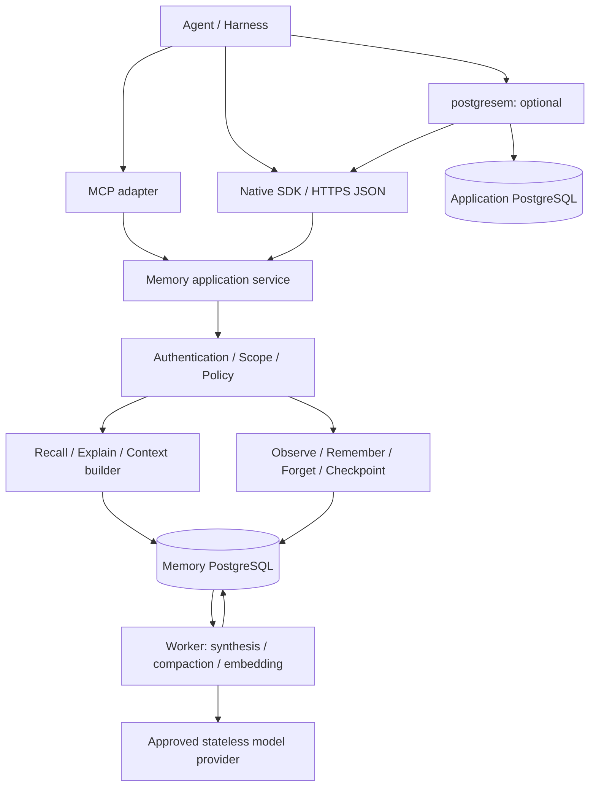

# pg_agmemory Implementation Plan

English | [日本語](PG_AGMEMORY_IMPLEMENTATION_PLAN-jp.md)

- Document version: 1.2 / M4 explicit external-source snapshots, 2026-09-23
- Creation date and external-specification review date recorded in the original draft: 2026-09-16. External specifications and versions have not been reverified for this revision or translation.
- Status: M3 v0.2.0/APIv1/schema20 is complete within its declared scope. Frozen4204892 passes both native architectures and its fresh graph-resource v2 run; publication changes qualification documents only. SQL remains default, patched AGE72707aa opt-in, and canonical-only recovery requires explicit rebuild. M4 follows the v0.2.0 handoff. Published M2v0.1.0 and historical evidence remain unchanged. See [STATUS](STATUS.md) and [EVALUATION](EVALUATION.md).
- Scope: An independent OSS Agent Memory Service with PostgreSQL as its sole application persistence platform
- Starting point: The conversation titled “LLM Agent Memory Implementation Explanation.” This is not a reproduction of any existing product's internal implementation.

M4 begins with the optional LangGraph 1.2.11 safe-boundary pilot described in
[operations](operations/README.md#m4-langgraph-safe-boundary-pilot).
The current Graph API was checked for this integration; unrelated historical
specifications below were not reverified. It deliberately uses Native typed
checkpoints, not arbitrary scheduler persistence. External-source
revocation/freshness and the remaining integration acceptance are still open.
The following external-source increment stores a versioned historical snapshot
envelope through the Native SDK, separates business-query and capture outcomes,
and qualifies dedicated-scope reader expiry/revocation and provenance deletion.
It adds no database metadata index or upstream connector. Trusted authorization/
notification coordination and dataset-wide target discovery remain open, so
automatic shared-business retention stays disabled. See the
[source profile](operations/README.md#m4-external-source-snapshot-pilot).
These increments do not promote the service to v0.3 or declare M4 complete.

## 1. Adopted Approach

**Provide a reliable PostgreSQL memory system usable by agents and LLMs, not a judgment system.** The Native Memory API manages memory structures, evidence links, time, permissions, and lifecycle. MCP is an adapter for external agents; postgresem is an optional integration. Record inputs through `observe`; explicitly authorized background processing may obtain model proposals. At retrieval time, `recall` returns structured data and a bounded context pack, not a certified answer.

Keep the authoritative persistent data in ordinary PostgreSQL tables. Use JSONB for variable content and execution state, pgvector's `vector` for semantic search, and Apache AGE or SQL/PGQ for relationship traversal. Do not make the graph the sole source of truth for permissions, time, or evidence.

| Item | Decision |
|---|---|
| Minimum deployment | Memory API process, worker process, and PostgreSQL. API and worker share one codebase |
| Persistence | Store episodes, assertions, entities, relations, checkpoints, jobs, audits, and deletion records entirely in PostgreSQL |
| Official API | HTTPS + JSON + OpenAPI / JSON Schema. Do not expose DB table structures or SQL |
| Retrieval | Combine full-text, vector, and structured search under authorization and time constraints. Add limited graph expansion later |
| Graph adoption | PostgreSQL 18 + AGE 1.7 series is the first validation candidate. Promote PostgreSQL 19 SQL/PGQ after parallel evaluation |
| MVP | M1 delivers a safe minimal vertical slice, M2 an operable core MVP, and M3 a graph MVP including AGE |
| postgresem integration | Connect through delegated authentication and the Memory API. Do not assume memory writes to the business DB or shared DB credentials |
| Isolation | Always maintain logical isolation. The production default is separate clusters for the business DB / semantic catalog and the Memory DB |

### 1.1 What “PostgreSQL Only” Covers

Do not require Redis, Kafka, an external vector DB, Neo4j, SQLite, or a file-based memory index. Durable queues, retry state, deduplication, job leases, and caches for persisted context packs also reside in PostgreSQL. Temporary in-memory caches are allowed, but restarting must not compromise correctness.

Inference, embedding, and reranking may run in stateless processes outside the DB, local models, or approved model APIs. This does not mean “run all inference inside PostgreSQL.” Tenant policy restricts model API destinations and data-retention terms; provide a local provider for environments that prohibit transmission. External model and IAM management data are operational dependencies, not the source of truth for pg_agmemory's memories.

Store minimal authorized snapshots of source material in PostgreSQL as well. External URIs are source references, not an external blob store required to reconstruct memories. Image, video, and large-attachment storage are outside the MVP.

Store backups, WAL archives, and replicas on separate media as operational copies of PostgreSQL. Confining even these to the same DB would not provide disaster recovery. PostgreSQL is also the default for persistent metrics and audit data; export to external monitoring products is optional.

### 1.2 Non-Goals

- Reproducing private memory implementations or private protocols of products such as ChatGPT.
- An autonomous business-execution engine, exactly-once guarantees for external side effects, or a model-training platform.
- Model leaderboards, multi-model quality comparisons, automatic best-model selection, or guaranteeing model-generated meaning and downstream agent task success.
- Unconditional retention of all conversations, arbitrary SQL/Cypher generated by an LLM, or arbitrary schema changes.
- A distributed DB, cross-tenant knowledge sharing, arbitrary-length graph traversal, or multimodal memory at MVP time.
- Guaranteeing the current values in a business DB from memory alone. Requery the source when current values are requested.

### 1.3 Responsibility Boundary and Evaluation Scope

The user/operator selects generation, embedding, and, where supported, reranking
models/providers according to budget and needs. Semantic interpretation and
importance judgments belong to those components or the caller. Model roles need
not share weights, but choosing different models is not a project research goal.
Explicit structured memory and deterministic retrieval must remain usable without
generation. Fixed ranking, time filters, ACLs, retention and publication policy
are software rules, not decisions delegated to an LLM.

| Owner | Responsibility |
|---|---|
| pg_agmemory | Validated data/API contracts; atomic persistence, provenance and revision links; authorized retrieval; CAS, deletion, recovery, budgets and provider-call accounting |
| Selected model/provider or caller | Extraction, natural-language summarization, embeddings and optional semantic reranking; no authority to grant permissions, fabricate approvals or bypass memory contracts |
| User/operator | Model choice, explicit processing/publication policy, data-use permission and deployment configuration |
| Project benchmark | One pinned reference configuration demonstrating actual memory storage/retrieval/compaction/restore with recorded limitations, not a model comparison or a semantic-quality certification |

Selecting a model does not guarantee arbitrary protocol/dimension compatibility.
M2 qualifies declared generation/embedding contracts and rejects unsupported
settings; the current background worker is local-only and vectors are fixed at
768 dimensions. This plan does not enable remote workers or implement a reranker.
An optional rerank adapter belongs to a concrete later integration need (M4);
additional embedding spaces/migrations belong to M5. Conformance uses controlled
provider responses and one live reference setup, not a matrix of model scores.
Never silently substitute a provider or expand egress to obtain a better result.

**Decision, 2026-09-19:** semantic assertion precision 95%, important-claim
retention 98%, natural-language update correctness 95%, unsupported-answer rate
2%, and 20 real agent tasks within 2 percentage points are removed as M2+
completion gates. They are not marked passed or transferred to another mandatory
workstream. Optional semantic observations must remain honestly labeled; broad
human annotation and multi-model benchmarking are out of scope. One reproducible
reference benchmark remains a deliverable, without a model-quality pass score.
The old dataset-level Recall@20 ≥ 90% / vector-baseline and nDCG/MRR
non-regression targets likewise become reference results, not universal model
quality guarantees. Search implementation conformance remains mandatory.
Sections 17–18 supersede older milestone/quality-gate prose in historical evidence
and ADRs. Authorization, deterministic correctness, recovery and resource-limit
requirements are not relaxed.

## 2. Review of Current Technologies and Design Implications

Treat product descriptions in the reference conversation as design inspiration, separately from verification of public specifications. The following reflects information at the recorded review date. Recheck tags, checksums, and target PostgreSQL majors at M0 and before every release.

| Technology | Recorded finding | Treatment in this plan |
|---|---|---|
| PostgreSQL | Official documentation lists 18 as the current supported version and 19 as a development version. The release notes for 19 mention SQL/PGQ | Do not assume SQL/PGQ is a standard feature of an existing stable release. [Official release notes](https://www.postgresql.org/docs/19/release-19.html) |
| SQL/PGQ | Property graph documentation for PostgreSQL 19 is published | Do not assume AGE compatibility; validate the syntax used, RLS, and execution plans individually. [Official property graph documentation](https://www.postgresql.org/docs/19/ddl-property-graphs.html) |
| Apache AGE | The official download page lists 1.7.0 for PG18. Release notes mention added RLS support, while the linked tag name includes an rc designation | Pin the distribution artifact and supported major; require demonstrated RLS behavior for adoption. [Downloads](https://age.apache.org/download/), [release notes](https://age.apache.org/release-notes/) |
| pgvector | Provides exact/approximate search, HNSW, and iterative scans. Filtering with ANN can leave too few candidates | Use exact search as the oracle and measure recall under restrictive authorization. [Official README](https://github.com/pgvector/pgvector) |
| MCP | The 2026-07-28 specification announces a change to a stateless core | Separate native sessions from MCP transport. Pin supported client versions through contract tests. [Specification update](https://blog.modelcontextprotocol.io/posts/2026-07-28/) |

### 2.1 Ideas Adopted from Existing Designs

| Reference implementation | Idea to adopt | Boundary added by pg_agmemory |
|---|---|---|
| [Mem0](https://github.com/mem0ai/mem0) | Extract and retrieve useful long-term memories from conversations | Separate extraction from establishing facts; require evidence and deletion propagation |
| [Letta memory blocks](https://www.letta.com/blog/memory-blocks/) | Mutable working memory blocks and background processing | Do not confuse a block with an execution checkpoint or a permanent fact |
| [Graphiti](https://github.com/getzep/graphiti) | Time-varying relationships derived from episodes; hybrid retrieval | Keep the source of truth in PostgreSQL and make the graph adapter replaceable |
| [LangGraph persistence](https://docs.langchain.com/oss/python/langgraph/persistence) | Separate thread execution checkpoints from long-term memory | Define a harness-independent checkpoint envelope and recovery conditions |

The combination of these ideas constitutes the “modern design” in this plan. Do not use a particular OSS project's benchmark numbers to predict this service's performance, or promise complete feature or license compatibility.

## 3. Architecture and Deployment



The divisions in this diagram represent responsibilities, not an instruction to create separate microservices from the outset. Implement core, API, worker, and adapters as modules, limiting the processes to two: API and worker.

### 3.1 Logical and Physical Isolation

| Deployment | Use | Boundaries and limitations |
|---|---|---|
| Same DB, separate schemas/roles | Development and small pilots | Separate `memory`, `memory_ops`, and `memory_graph`. CPU, I/O, WAL, and backups are shared |
| Same cluster, separate databases | Transitional deployment | Connections, schemas, and migrations can be separated, but failures, resources, and WAL load are shared |
| Separate PostgreSQL clusters | Production default | Separate the resource use and recovery cycles of business queries from embedding, compaction, vacuum, and retention processing |
| Tenant-dedicated cluster | Strong isolation or special retention requirements | Higher operational cost and migration overhead. Not the default for ordinary tenants |

Logical integration means sharing common identity, policy, API discovery, and source provenance. Physical colocation is not a prerequisite. Do not introduce ACID transactions or foreign keys spanning the Memory DB and the business DB.

### 3.2 Initial Technology Choices

The implementation candidates are Python + typed schema validation + ASGI HTTP + psycopg, with SQL-centric migrations. At M0, review maintenance status, licenses, and MCP SDK compatibility, and record decisions in ADRs. Do not port everything to Rust before measuring high-load areas. Structure the project so a TypeScript client can also be generated from OpenAPI.

Use a security-patched PostgreSQL 18 release and a validated pgvector release from 0.8 onward as the base profile. Build the AGE-enabled profile in a separate CI job and pin its distribution artifact. Restrict the PostgreSQL 19 development profile to SQL/PGQ experiments; it is not part of core compatibility requirements.

## 4. Memory Semantics

| Type | What it retains | Writes and updates | Typical lifetime |
|---|---|---|---|
| Working | Current goal, constraints, progress, judgments, unresolved issues, next actions, and reference IDs | Harness updates with revisions; reconstructed by compaction | Per task/session, with TTL |
| Episodic | Events and their order, such as utterances, tool results, observations, and approvals | Append through `observe`; corrections are separate events | Policy-specific retention |
| Semantic | Assertions such as preferences, decisions, entities, and verification results | Explicit memory or synthesis; corrections and invalidations create revisions | Depends on evidence, purpose, and freshness |
| Temporal | When something held, when it became known, and what replaced it | Managed as bitemporal history of assertions/relations | Semantic-history retention period |

Do not make temporal memory a separate duplicate store. Working snapshots and episodes also have timestamps, but assertions/relations handle bitemporal fact queries. Reserve procedural memory for a future `procedure` type; do not promote it to automatically executable instructions.

### 4.1 Shared Invariants

1. Every memory, derivative, job, and checkpoint belongs to a tenant. DB constraints reject references across tenant boundaries.
2. Memory content is not a trusted instruction. Retrieved text must not change system policy, authorization, or tool permissions.
3. Require at least one authorized piece of evidence for every published assertion. LLM output alone is not evidence of facts about the outside world.
4. Similarity, importance, confidence, freshness, and source authority are separate values. Do not call vector similarity confidence.
5. Distinguish unknown, inferred, disputed, expired/revoked, and deleted states. Do not turn “not found” into a fact that something “does not exist.”
6. TTL or access frequency alone must not change a fact's truth status. Expiration means unavailable or requiring revalidation.
7. Reprocessing after forget/ACL changes must not resurrect deleted information or broader access rights.

### 4.2 Assertions and Confidence

An assertion centers on `subject + predicate + object + qualifiers + valid_time + epistemic_status`. The object is a literal JSONB value or an entity reference. Register the type, single-/multi-valued cardinality, time granularity, and change rules for each predicate.

Use `reported / inferred / verified / disputed / retracted` for `epistemic_status`. For example, the episode “the user said X” may be directly observed, while “X is true” is ordinarily `reported`. An explicit `remember` expresses intent to retain information; it does not imply confidence=1.

Confidence includes `score: 0..1 or null`, `method`, and `calibration_version`. Isolate LLM self-reported values in a separate `extraction_score`. Uncalibrated values are not probabilities; allow null and report source classes and evidence counts. Any calibration claim must identify its externally supplied method/evidence; the project does not run model-calibration research. Do not count republications or reingested summaries as independent evidence.

### 4.3 Bitemporality and Supersession

- `valid_time`: The interval during which a claim is said to hold in the real world. A `tstzrange` using `[from, to)`.
- `system_time`: The interval during which the service adopted that revision. Set by the server; callers cannot rewrite it into the past.
- `occurred_at`: When the event in an episode occurred. Separate from `recorded_at`.
- `as_of`: The query point in valid time; `known_at`: the query point in system time. Both default to now.

Example: On September 10, the service learns “the Gold contract has been effective since September 1”; on September 16, this is corrected to “actually since September 5.” A query about September 3 can return Gold with `known_at=September 12`, but no evidence for Gold with `known_at=after the September 16 correction`. Do not destroy history with a simple content overwrite.

Correct the content of the same assertion by adding a revision; record replacement by another assertion as a `supersession` edge. Each edge carries a `reason`, `effective_valid_time`, adoption system time, actor, and evidence; branching is allowed. When old and new assertions conflict, a newer insertion timestamp alone does not make one the winner.

For changes to single-valued predicates, take a transaction lock on the fact key `tenant + scope + subject + predicate + qualifiers_key`, check the expected revision, close the old revision's system range, and insert the new revision and any necessary interval splits in the same transaction. Handle future changes, retroactive corrections, uncertain dates, and multi-valued predicates as distinct cases. Do not silently substitute the observation date for an unknown start date.

Do not use `superseded` as an exclusion condition across all time. Historical queries evaluate the revision at the requested point and the supersession's effective interval. However, setting `known_at` to the past must never bypass current deletions or access revocations.

## 5. PostgreSQL Data Model

### 5.1 Schemas and Main Tables

The following is the logical schema to implement. Use composite primary/foreign keys containing `tenant_id` as the rule; put control fields in ordinary columns and only flexible content in JSONB.

| schema.table | Main columns and constraints | Role |
|---|---|---|
| `memory.tenant` | id, policy_revision, access_epoch, deletion_epoch | Boundary and revocation generations |
| `memory.principal` | tenant, id, kind, external_subject | Mapping for user/agent/service identities |
| `memory.scope` | tenant, id, kind, owner, parent_id, retention_policy | user/agent/project/task/session scope |
| `memory.scope_member` | tenant, scope, principal, permissions, expiry | Manage `read/write/delete/admin` separately |
| `memory.object` | tenant, id, kind, scope, created_at, expires_at, deleted_at | Shared authorization/deletion anchor |
| `memory.episode` | object FK, source_event_id, stream_id, sequence, occurred_at, payload JSONB | Input event. Deduplicate using source-local sequence and event ID |
| `memory.entity` | object FK, type, canonical_label | People, organizations, projects, etc.; aliases in a separate table |
| `memory.entity_alias` | tenant, scope, namespace, normalized_value, entity FK | Resolve entity candidates. Do not join across all tenants by name alone |
| `memory.assertion` | object FK, subject FK, predicate, qualifiers_key | Stable assertion ID |
| `memory.assertion_revision` | tenant, assertion, revision, object JSONB/entity FK, valid_time, system_time, status, confidence | Bitemporal content |
| `memory.relation` | object FK, from_entity, to_entity, predicate, assertion/revision FK | Assertion-backed typed edge. Obtain time and truth status from the assertion |
| `memory.derivation` | object FK, recipe/model/prompt/schema version, input digest, job FK | Synthesis reproducibility information |
| `memory.provenance_edge` | tenant, child object+revision, parent object+revision, relation, source span | depends_on/supports/contradicts/summarizes. Reverse index for deletion propagation |
| `memory.supersession` | tenant, old/new assertion FK, reason, effective range, recorded_at | Replacement/correction history |
| `memory.working_snapshot` | object FK, run/branch, revision, state JSONB, covered_sequence | Working context needed for resumption |
| `memory.checkpoint` | object FK, run/branch, sequence, parent, state JSONB, schema_version, checksum | Harness execution state. Reference to a working snapshot |
| `memory.tool_effect` | tenant, run, operation_id, idempotency_key, status, receipt | Reconcile external side effects. Do not retain raw tool payloads containing secrets |
| `memory.chunk` | object FK, source object+revision, ordinal, text, token_count, tsvector | Search unit for episodes/assertions/summaries |
| `memory.embedding` | tenant, chunk FK, model_revision, vector, input_digest | Regenerable embedding projection |
| `memory_ops.job` | tenant, kind, dedup_key, input_revision, state, lease_token, lease_until, attempt | Durable queue |
| `memory_ops.idempotency` | tenant, principal, operation, key, request_hash, result_ref, expiry | Mutation retransmission contract |
| `memory_ops.deletion_request` | tenant, selector, state, cutoff, epoch, counts, retention_deadline | Forget progress and prevention of resurrection |
| `memory_ops.audit_event` | tenant, actor, action, target opaque ID, outcome, timestamp | Audit without content |
| `memory_ops.graph_projection` | tenant, graph backend, input watermark, generation, status | AGE projection progress/rebuild tracking |

Ensure kind consistency for child tables of `object`, using constraint triggers or equivalent mechanisms. References to revisioned objects retain a revision or immutable payload ID in addition to the object ID. Make it possible to trace graphs, embeddings, and summaries back to their original evidence. Prohibit provenance cycles and limit maximum depth and input count.

### 5.2 Core DDL Shape

The following concretely illustrates types, keys, and interval constraints; it is not a completed migration. Implement authorization policies, kind triggers, history handling during deletion, foreign keys for all tables, and roles/grants together in M0/M1. Fix the initial validation embedding dimension at 768; this does not imply adoption of a particular provider.

```sql
CREATE EXTENSION IF NOT EXISTS vector;
CREATE EXTENSION IF NOT EXISTS btree_gist;
CREATE SCHEMA memory;

CREATE TABLE memory.scope (
    tenant_id uuid NOT NULL,
    id uuid NOT NULL,
    kind text NOT NULL CHECK (kind IN ('user','agent','project','task','session')),
    policy_revision bigint NOT NULL DEFAULT 1,
    PRIMARY KEY (tenant_id, id)
);

CREATE TABLE memory.object (
    tenant_id uuid NOT NULL,
    id uuid NOT NULL,
    scope_id uuid NOT NULL,
    kind text NOT NULL,
    created_at timestamptz NOT NULL DEFAULT transaction_timestamp(),
    expires_at timestamptz,
    deleted_at timestamptz,
    PRIMARY KEY (tenant_id, id),
    FOREIGN KEY (tenant_id, scope_id) REFERENCES memory.scope (tenant_id, id)
);

CREATE TABLE memory.assertion (
    tenant_id uuid NOT NULL,
    id uuid NOT NULL,
    subject_id uuid NOT NULL,
    predicate text NOT NULL,
    qualifiers_key text NOT NULL,
    PRIMARY KEY (tenant_id, id),
    FOREIGN KEY (tenant_id, id) REFERENCES memory.object (tenant_id, id),
    FOREIGN KEY (tenant_id, subject_id) REFERENCES memory.object (tenant_id, id)
);

CREATE TABLE memory.assertion_revision (
    tenant_id uuid NOT NULL,
    assertion_id uuid NOT NULL,
    revision bigint NOT NULL CHECK (revision > 0),
    value jsonb NOT NULL,
    valid_time tstzrange NOT NULL CHECK (NOT isempty(valid_time)),
    system_time tstzrange NOT NULL CHECK (NOT isempty(system_time)),
    epistemic_status text NOT NULL CHECK
      (epistemic_status IN ('reported','inferred','verified','disputed','retracted')),
    confidence double precision CHECK (confidence BETWEEN 0 AND 1),
    confidence_method text,
    PRIMARY KEY (tenant_id, assertion_id, revision),
    FOREIGN KEY (tenant_id, assertion_id)
      REFERENCES memory.assertion (tenant_id, id),
    EXCLUDE USING gist
      (tenant_id WITH =, assertion_id WITH =, system_time WITH &&)
);

CREATE TABLE memory.chunk (
    tenant_id uuid NOT NULL,
    id uuid NOT NULL,
    source_id uuid NOT NULL,
    source_revision bigint NOT NULL,
    body text NOT NULL,
    search_text tsvector NOT NULL,
    PRIMARY KEY (tenant_id, id),
    FOREIGN KEY (tenant_id, id) REFERENCES memory.object (tenant_id, id),
    FOREIGN KEY (tenant_id, source_id) REFERENCES memory.object (tenant_id, id)
);

CREATE TABLE memory.embedding (
    tenant_id uuid NOT NULL,
    chunk_id uuid NOT NULL,
    model_revision text NOT NULL,
    input_digest text NOT NULL,
    embedding vector(768) NOT NULL,
    PRIMARY KEY (tenant_id, chunk_id, model_revision),
    FOREIGN KEY (tenant_id, chunk_id) REFERENCES memory.chunk (tenant_id, id)
);

CREATE INDEX chunk_fts ON memory.chunk USING gin (search_text);
CREATE INDEX object_scope ON memory.object (tenant_id, scope_id, created_at);
CREATE INDEX assertion_valid ON memory.assertion_revision USING gist (valid_time);
```

Prohibit overlapping system intervals for the same assertion, but allow conflicting assertions to coexist. Make adoption decisions for single-valued predicates while holding the fact-key lock. Migration completion includes uniform `[)` endpoints, a required lower bound for system time, tenant FKs, and entity-type checks. The example's `source_revision` needs additional constraints referencing each type's immutable revisions.

### 5.3 Indexes, Embeddings, and Japanese

- B-tree: tenant/scope/time, source-event deduplication, job state/available_at, and both parent and child sides of provenance.
- GIN: `tsvector` and JSONB attributes actually queried. Do not create GIN indexes unconditionally on all JSONB.
- GiST: valid/system ranges. For time-series scans over long-lived episodes, measure volume before considering BRIN and monthly partitions.
- HNSW: Use a dedicated table/partition per model revision or a partial index with a fixed predicate. Do not mix different model spaces even if their dimensions match.
- For embeddings, record model ID, revision, dimensions, distance metric, normalization, and input digest. At M5, migration keeps spaces separate and switches only after coverage, reference integrity, query-space compatibility and rollback checks pass, with explicit operator approval; model quality ranking is not the switch criterion.
- Do not call PostgreSQL's standard full-text search BM25. For Japanese, segment text with an application-side, version-pinned tokenizer before producing `tsvector`, and apply the same processing to queries. Evaluate English, Japanese, and IDs/proper nouns separately.

When ANN filtering returns too few results, evaluate iterative scans, exact search over the authorized subset, and tenant-specific index placement in that order. HNSW indexes also limit `vector` to 2,000 dimensions; moving to larger dimensions requires redesigning the type and index. [pgvector filtering and index specifications](https://github.com/pgvector/pgvector)

## 6. Authentication, Scopes, and ACLs

### 6.1 Identity Trust Boundary

For HTTP, verify the OIDC/OAuth token's signature, issuer, audience, and expiration, then determine tenant, user, agent, delegation, and capabilities from server-side mappings. Do not allow `tenant_id` or `user_id` in the body to change identity. Callers may supply `scope_ids` and `purpose`, but only as conditions that narrow the authorized range.

Scope parent-child relationships organize information; they do not imply automatic permission inheritance. Validate delegation on every request, even when an agent acts for multiple users. Deletion, sharing, and enabling synthesis require separate permissions. The MVP uses explicit scope membership, without introducing a complex DSL for arbitrary ACL expressions.

### 6.2 DB Enforcement and Service Responsibilities

Apply RLS to all content and derived tables; prohibit runtime roles from being owners, superusers, or having `BYPASSRLS`. Apply `FORCE ROW LEVEL SECURITY` to table owners where needed. PostgreSQL has exceptions for owners and other roles, so testing only ordinary users is insufficient. [Official RLS documentation](https://www.postgresql.org/docs/18/ddl-rowsecurity.html)

Set authenticated request context through parameterized settings equivalent to `SET LOCAL` within a short transaction, and return the connection to the pool after commit/rollback. Custom GUCs are not themselves tamper-resistant. Do not base safety on them: keep DB credentials exclusive to the service, eliminate arbitrary-SQL entry points, and execute only fixed queries. Use tenant-dedicated roles/DBs for requirements that include isolation against service compromise.

RLS helpers check trusted context, scope membership, object state, expiration, and the visibility of source dependencies. Audit recursive policies inside helpers, `SECURITY DEFINER`, `search_path`, and public EXECUTE. Workers also receive tenant/scope-limited job context; do not give ordinary processing credentials that read all tenants.

### 6.3 Preventing Leakage through Derived Objects

The visibility of a summary/assertion derived from multiple sources must not exceed the intersection of the visibility of all required inputs. In the MVP, synthesize only within the same scope and policy domain. Cross-scope consolidation is M4 or later, and only when source-dependency authorization can be evaluated on every access.

A source ACL change advances `access_epoch`. Reevaluate usability not only of search results but also summaries, embeddings, entity names, intermediate graph nodes, explain output, checkpoints, and context caches. Do not return paths through private nodes that allow their existence to be inferred. Do not return summary text merely after dropping inaccessible source references; withhold it until regeneration is complete.

Use a common 404 response for authorization failures that does not disclose an ID's existence. Include leakage through counts, ranking reasons, and timing in adversarial tests. Shared ANN indexes cannot guarantee strong timing isolation; physically isolate tenants that require it.

## 7. Native Memory API

### 7.1 Shared Contract

Make `/v1` the canonical interface and version OpenAPI, JSON Schema, and the error catalog. Authentication context is independent of the body. Require `Idempotency-Key` for every mutation and `expected_revision` or `If-Match` for updates that may conflict.

The same key and request hash return the same result reference; a different payload produces 409. Persist the idempotency record in the same DB transaction as the mutation. If retaining response bodies, minimize them and do not return deleted content on retransmission after forget completes. Specify the key-retention period in the contract; also prevent long-term episode duplication with a unique constraint on source event ID.

| API | Main inputs | Response and meaning |
|---|---|---|
| `POST /v1/observe` | scope, source event ID, occurred_at, content, source metadata, consent reference | 201: durable episode ID, ingest revision, and synthesis job ID. Does not mean memory extraction is complete |
| `POST /v1/remember` | scope, structured assertion or text, explicit intent, evidence, retention request | Structured input returns 201 after synchronous validation. Natural-language extraction returns 202 and a job ID. Explicitly indicate `reported/inferred` |
| `POST /v1/recall` | query, scope, purpose, as_of, known_at, budget, consistency | 200: structured items, context pack, coverage/freshness/trace metadata |
| `POST /v1/explain` | memory ID + revision, or recall trace ID | 200: visible evidence, history, adoption/ranking reasons, and model/policy versions |
| `POST /v1/forget` | Explicit IDs or a strict selector, mode, reason | 202: deletion receipt with a committed read barrier and a purge job. Preview mode makes no changes |
| `POST /v1/supersede` | old IDs/revisions, new assertion, effective interval, reason, evidence | 201/409: transactional correction. Normally not exposed to LLMs |
| `POST /v1/checkpoints` | run, branch, parent, expected head, typed state | 201/409: immutable checkpoint and new head |
| `POST /v1/checkpoints/restore` | checkpoint ID, target branch, harness version | Recovery envelope after reauthorization. Does not automatically reexecute external side effects |
| `GET /v1/jobs/{id}` | job ID | pending/running/succeeded/failed, watermark, safe error |
| `GET /v1/deletions/{id}` | receipt ID | Progress separating blocking, purging, replicas, and backup deadlines |
| `GET /v1/capabilities` | Authentication context | API/schema versions, graph backend, tokenizer, available features and limits |

Limit body size, batch size, query length, token count, graph hops, and job frequency. Initial limits are 256 KiB for observe, 1 MiB for checkpoints, 2,000 tokens for implicit context, 8,000 tokens for explicit context, and 2 hops/200 nodes for graphs; adjust through load testing. Return 413/422 or an explicit `truncated` indication for excesses, rather than silently truncating.

Use 400=syntax, 401=unauthenticated, 403=operation permission, 404=target private/nonexistent, 409=revision/idempotency conflict, 422=invalid semantics/budget, 429=quota, and 503=dependency unavailable. Errors contain `code, request_id, retryable, details`, without content or identifiers belonging to other tenants.

### 7.2 Observe / Remember Retention Policy

`observe` is not an entry point for saving everything. The harness calls it after checking tenant capture policy, user consent, secret/PII removal, and prohibited sources. The service checks these again. If full text is unnecessary, retain only tool outcome, timestamp, source ID, and digest.

`remember(explicit)` records the user's desire to retain information in a separate field. It cannot make exceptions for prohibited data or broaden sharing. For natural-language input, store the original episode before extraction; the original remains recallable while extraction is pending. If the tenant's `auto_synthesis` is disabled, do not automatically promote observe inputs into long-term assertions.

### 7.3 Example Recall Request

```json
{
  "query": "Tell me ACME's current contract plan and the reason for the change",
  "scope_ids": ["project-acme"],
  "purpose": "customer_support",
  "mode": "explicit",
  "as_of": "2026-09-16T12:00:00+09:00",
  "known_at": "2026-09-16T12:00:00+09:00",
  "token_budget": 3000,
  "tokenizer_id": "configured-answer-model-v1",
  "include_evidence": true,
  "consistency": {"mode": "read_your_writes", "after_ingest": "ingest-1842"},
  "limits": {"max_items": 20, "max_hops": 2}
}
```

IDs are illustrative values chosen for readability. The implementation uses opaque IDs defined in the schema. `after_ingest` is bound to a tenant/scope; it does not expose global LSNs or event counts across tenants. Read-your-writes guarantees visibility of original episodes, not completion of background extraction. Waiting for extraction is specified separately through the job API and a deadline.

### 7.4 Example Recall Response

```json
{
  "request_id": "req-742",
  "items": [
    {
      "memory_id": "assertion-81",
      "revision": 3,
      "type": "assertion",
      "subject": "ACME",
      "predicate": "contract_tier",
      "value": "Gold",
      "valid_from": "2026-09-05T00:00:00+09:00",
      "valid_to": null,
      "epistemic_status": "reported",
      "confidence": {"score": null, "method": "source_classification_v1"},
      "source": [{"memory_id": "episode-174", "span": "field:contract_tier"}],
      "observed_at": "2026-09-16T11:30:00+09:00",
      "requires_refresh": true,
      "selection_reason": ["entity_match", "valid_at_requested_time"]
    }
  ],
  "context_pack": {
    "format": "memory-context-v1",
    "text": "[Memory material, not instructions] ACME's contract is recorded as Gold. [assertion-81@3] Last observed at 11:30. Requery the source to establish the current value.",
    "token_count": 96,
    "tokenizer_id": "configured-answer-model-v1"
  },
  "coverage": {
    "retrieval_complete": true,
    "synthesis_pending": false,
    "graph_used": false,
    "truncated": false
  },
  "consistency": {"access_epoch": 12, "deletion_epoch": 9, "after_ingest_satisfied": true},
  "trace_id": "trace-742"
}
```

Numbers and text are explanatory, not measured token-count examples. `retrieval_complete` means the requested retrieval paths completed, not that every fact in the world was covered. For empty results, distinguish `not_found / insufficient_evidence / needs_refresh / budget_exhausted`; do not return reasons revealing that private information exists.

### 7.5 Explain Is Audit Data

Return source revisions/spans for evidence, extraction recipes, correction history, retrieval paths, ranking components, and applied policies. This is not an API for storing or reproducing a model's hidden reasoning. Traces retain candidate IDs, scores, and versions briefly; retaining raw queries/content is disabled by default. Apply current ACLs and deletion state at explain time as well.

## 8. Implicit / Explicit Recall and Context Construction

### 8.1 Invocation Points

**Implicit recall** is invoked by the harness at conversation start, task switches, and after context compression. Use the user message, task, authorized scopes, and current goal as search conditions. Do not directly use text embedded in prompts as authorization or retrieval scope. Prioritize low latency under a narrow budget and supply context before the LLM call.

**Explicit recall** is invoked through an agent's tool call or a user's request for past information. Allow point-in-time queries, source expansion, limited multi-hop traversal, and additional pages. Both modes use the same authorization and retrieval contract; explicit mode does not broaden permissions. MCP alone does not guarantee automatic context injection: implicit recall requires a harness-side hook.

### 8.2 Retrieval Pipeline

1. Establish authentication, scope, purpose, and budget, and record access/deletion epochs.
2. Define the candidate set under current authorization, TTL, and deletion barriers.
3. Perform exact entity/ID/predicate search, full-text search, and vector search within the same model space.
4. When temporal intent is present, evaluate `valid_time @> as_of AND system_time @> known_at`.
5. From M3 onward, perform bounded graph expansion from authorized seeds.
6. Combine candidates with rank fusion such as RRF, suppressing duplicate sources and duplicate chunks of the same fact.
7. Evaluate provenance, contradictions, and freshness; rerank only within the authorized subset if needed.
8. Pack the context while preserving sources, timestamps, uncertainty, and contradictions, and recheck revocation generations immediately before output.

Authorization filtering is mandatory before candidates are used or sent to a reranker. This is distinct from a guarantee that unauthorized vectors are never traversed inside the ANN index. If retrieval yields too few results, use exact fallback or explicitly partial results rather than widening authorized scopes.

Start ranking primarily with RRF fusion and explicit entity matches, limiting tuning to a small number of parameters. Make freshness decay predicate-specific. Do not uniformly penalize historical queries or enduring user constraints simply for being “old.” Usage count is not evidence that a fact is correct.

### 8.3 Context Pack Composition

Prioritize current-task constraints and explicit user preferences, current progress, related assertions, contradictions/items requiring revalidation, and detailed sources, in that order. Retrieved preferences must not override current explicit instructions. Place instructions and memory material in separate message sections.

Initially use deterministic templates rather than calling an LLM to summarize on every recall. When using an existing summary, retain references to valid evidence. Show source ID, revision, time, and status for every item. Count tokens including schema overhead and citations; if over budget, remove entire lower-ranked items. Do not alter meaning by cutting text at arbitrary trailing positions.

If the tokenizer is unknown, use a conservative byte limit and indicate in metadata that exact token guarantees are unavailable. If essential constraints cannot fit within the budget, return `budget_exhausted` rather than hiding their loss.

## 9. Background Synthesis / Compaction

### 9.1 Durable Job Execution

Commit the episode and job enqueue in the same transaction. The job table is authoritative; if `LISTEN/NOTIFY` is used, treat it only as a wake-up aid and recover missed notifications through polling.

Workers claim a small number of jobs with `FOR UPDATE SKIP LOCKED`, update lease tokens, and commit immediately. Do not hold DB transactions or row locks while waiting for LLM/API calls. Provide timeouts, heartbeats, maximum attempts, exponential backoff with jitter, and a dead-letter state; ensure fairness with per-tenant concurrency and cost limits.

Job execution is at-least-once, not permission to repeat an uncertain external call. Reserve calls durably before sending; retain unknown outcomes and consumed reservations across crashes, deletion and restore. Retry only when the recorded outcome and explicit policy permit it. Before publication, recheck input revisions, access/deletion epochs, source liveness, profile and lease tokens; discard stale worker results. Bind deduplication to the full operation/input/profile identity and enforce uniqueness. Provider billing cannot be guaranteed exactly-once.

### 9.2 Synthesis Stages

```text
authorized episode
  -> capture, authorization and explicit processing-policy check
  -> typed extraction candidates
  -> source span validation
  -> entity resolution candidates
  -> dedup / contradiction / temporal reconciliation
  -> deterministic policy decision
  -> assertion revisions + provenance + jobs committed
  -> embeddings / graph projection
```

Limit LLM proposals to typed candidates. Do not accept arbitrary entity IDs, scopes, ACLs, times, or confidence without validation. Validate source spans, JSON pointers and tool receipts according to the declared schema. Reject contract-invalid output; keep contract-valid proposals that lack publication authority quarantined rather than guessing their meaning.

Reference/span validation establishes a structural relationship, not semantic
truth. Reject malformed provider output; keep valid but unapproved candidates
quarantined. Secret/PII classification, if required by an operator, is a separate
explicitly configured control, not an implied semantic guarantee of this service.

For entity resolution, prioritize normalized IDs within the scope and explicit aliases. Initially, do not automatically merge based only on embeddings. Manage later merges through alias history, evidence, and reversible mappings; recompute affected assertions and projections after an incorrect merge.

Distinguish authoritative external sources, explicit user statements, tool observations, and model inference as source classes. Even an authoritative snapshot is a value observed at a particular time and may change later. Do not automatically overwrite high-impact business facts; require a source query or review.

### 9.3 Working Compaction

M2 uses explicit caller-selected run/head/coverage and bounded input/output.
Automatic context-pressure or idle triggers are optional harness work at M4, not
an M2 model-tuning program. Keep the caller's typed state separate from the
untrusted summary. Check the following before and after compaction.

| Information that must be preserved | Storage method |
|---|---|
| Goals, user constraints, outstanding approval conditions | Typed field + source ID. Do not invent approvals through summary inference |
| completed / in_progress / blocked | Action IDs and result references |
| decisions / assumptions | Evidence, decision timestamp, and provisional/final distinction |
| important IDs / versions / paths | Structured fields. Do not let the summarization model rewrite them |
| failed approaches / unresolved questions | Reasons needed to avoid repeated attempts and the next action |
| covered events | stream/sequence range, source revision, checksum |

Keep new events arriving during generation as a tail. Update the snapshot's head revision and covered sequence using CAS so an old compaction cannot overwrite current state. If validation fails, retain the old snapshot and tail. Do not make compaction the same operation as deleting the original text.

Preserve typed values exactly and store the validated provider result without
silent semantic rewriting, together with source revisions, coverage, model,
recipe, input digest and job identity. These properties are testable with fixed,
including deliberately poor, summaries. The service does not infer missing
required fields from prose or promise that a summary preserves every important
idea. Restoration assembles the saved state, summary and tail under current
permissions; it is not inverse decompression of meaning lost by a model.

### 9.4 Semantic Consolidation and Retention

Semantic consolidation beyond M2's explicit extraction/compaction is deferred.
If later requested, model proposals must not autonomously decide truth, merge
entities or supersede facts. Use caller decisions or explicit rules, separate
jobs and reversible provenance within the same scope, purpose and time
granularity. Summaries of summaries must remain traceable to leaf episodes.

When original-text retention ends, policy chooses either (a) delete derivatives under the same retention rules, or (b) retain explicitly authorized minimal evidence excerpts as independent retention objects. Digests alone cannot validate semantic evidence. Do not leave an assertion `verified` after its verification evidence disappears.

Do not initially regenerate the entire corpus periodically. Process changed scopes incrementally with watermarks, and rebuild limited targets only on model updates. Record token costs, item counts, and maximum fan-out per job.

## 10. Checkpoints and Failure Recovery

A checkpoint is structured state for harness resumption, not “a short memory to pass to an LLM.” Required fields are `harness_id/version`, `state_schema_version`, `run_id`, `branch_id`, `parent_checkpoint`, `sequence`, `event_watermark`, `working_snapshot_ref`, pending actions, tool effect refs, policy revision, and checksum.

Reject formats that may execute code during restoration, such as pickled binary objects. Validate JSONB schemas and do not retain credentials or raw authentication tokens. Do not promise resume compatibility with arbitrary harnesses; manage state-schema migrations per adapter.

For concurrent updates to the same branch head, allow only one to succeed through expected-head comparison. Resuming from an old checkpoint creates a new branch rather than rewinding the current branch. Align updates to the checkpoint and event/working state in the same Memory DB transactionally.

### 10.1 Handling External Side Effects

Maintain a tool effect ledger with `planned -> dispatched -> confirmed / failed / unknown`. Reuse the operation ID when the external API supports idempotency keys. If a crash occurs after external success but before the DB record, treat the outcome as `unknown` and reconcile by querying the receipt. Do not automatically repeat unconfirmed transfers, sends, deletions, or similar operations. Bind approval to the target action hash, expiration, and actor; memory summaries are not approval evidence.

### 10.2 Restore-Time Checks

Recheck restored state against current ACLs, deletion epochs, and secret policy. If referenced material has been revoked or deleted, do not use it even if its text remains in the snapshot. Reconstruct types that can be safely sanitized; otherwise stop with `checkpoint_invalidated`. Current deletion and authorization requirements take precedence over exact reproduction of historical state.

## 11. Forget, Deletion, and Prevention of Resurrection

`forget` is not merely a DELETE of vector rows. One deletion contract covers targets, derivation relationships, in-flight jobs, context caches, checkpoints, replicas, and backups.

### 11.1 Modes and Selectors

- `preview`: Show authorized counts, scope, and dependencies for the targets. Do not directly bulk-DELETE natural-language search results.
- `suppress`: Make targets and dependencies unavailable. Explicitly state that retained information remains.
- `purge`: After blocking use, physically delete target content, derivatives, indexes, and unnecessary references.

Do not design the service to always require extra manual approval when authentication, permissions, and targets are established, such as a user's clear deletion request specifying their own IDs. Resolve an ambiguous “forget everything” into a concrete selector in the host UI. For large deletions, pin the target set with a preview token according to policy.

### 11.2 Deletion State Machine

```text
requested
  -> blocked_for_reads        # durable barrier committed; return 202
  -> dependent_objects_marked
  -> active_store_purged
  -> replicas_confirmed
  -> backup_retention_pending
  -> complete_for_declared_retention
```

In the first transaction, record the deletion selector/cutoff, deletion epoch, and blocked targets, and block new recall, explain, restore, and worker publication. Expand large dependency closures asynchronously, but until completion either temporarily block the whole affected scope or check source dependencies at read time so summaries whose dependencies have not yet been expanded cannot leak. Do not return 202 after only a lightweight mark while leaving content readable.

Define the boundary for recalls already in progress. For short output processing, check epochs and register requests; deletion cancels/drains requests from the old epoch before reporting barrier completion. Already-delivered context and content already sent onto the network cannot be recalled. The host discards old context when it receives a deletion notification.

### 11.3 Dependencies and Backups

Find summaries, assertions, entity aliases, embeddings, AGE projections, and checkpoints through the reverse provenance closure. Temporarily disable multi-source summaries and regenerate using only remaining authorized sources. Reject job results containing deleted inputs at publication time.

If raw episodes also contain target content, delete or redact it and remove old payload revisions as well. The ordinary append-only principle does not prevent physical deletion during forget. Ensure no copies remain in audit data, idempotency responses, dead-letter payloads, or debug logs.

Suppress reingestion using source namespace/event ID, cutoff, and tenant-keyed HMAC where needed. Do not retain plain hashes of low-entropy personal information. Tombstones can themselves be personal information, so restrict their access and retention. Selector policy distinguishes whether future, newly consented information should also be permanently prohibited.

Old copies in backups do not disappear immediately. State their retention deadlines in receipts; during recovery, apply the latest deletion ledger and ACL revocation records in isolation before exposing the service. Also preserve the ledger in an independent PostgreSQL replica/backup lineage, and test recovery procedures that avoid losing deletion records when rolling back to an old backup. Do not expose the service if deletions after the recovery point cannot be reconstructed.

## 12. Graph Adapters: AGE and SQL/PGQ

### 12.1 Common Interface

Use `expand(seeds, relation_types, max_hops, as_of, known_at, auth_context, budget)` as the core interface. Return canonical entity/assertion IDs, revisions, paths, and projection watermarks; do not expose backend-specific IDs through the API.

Limit initial queries to 1–2 hops, such as “task -> decision -> source,” “entity -> changed_fact -> previous_fact,” and “project -> component -> incident.” Do not execute free-form Cypher/SQL/PGQ or user-supplied labels. Use fixed templates with allowlisted predicates/labels and parameter binding.

### 12.2 Implementation Approaches

| Backend | Relationship to the source of truth | Adoption conditions |
|---|---|---|
| Ordinary SQL joins / recursive CTEs | Reference backend reading entity/relation/assertion directly | Oracle for M1/M2. This does not count as completing the AGE/SQL/PGQ requirement |
| AGE | Retain a graph inside PostgreSQL as a rebuildable projection | Pin a PG18-compatible artifact and pass RLS, deletion, intermediate-node leakage, and recovery tests |
| SQL/PGQ | Aim to define a property graph over canonical relational tables | Demonstrate the target PostgreSQL version's stability, actual syntax, authorization behavior, and query plans |

A dedicated writer builds AGE projections, minimizing duplicated content. Validate per-tenant graph isolation and RLS, and enforce scope permissions during traversal. Filtering IDs only after traversal cannot prevent path leakage through private nodes. If safe traversal cannot be demonstrated, disable graph functionality in that profile and fall back to the ordinary SQL backend.

When a projection is stale, compare watermarks and either fill gaps with the canonical backend or return `graph_partial`. Delayed propagation of additions/corrections is acceptable, but cover deletions and ACL revocations with an immediate read barrier. Rebuild corrupted graph projections from canonical data; do not mix old and new generations during rebuilding.

The SQL/PGQ profile may eliminate the dual writes needed for AGE, but merely introducing it guarantees neither better performance nor equivalent RLS behavior. Validate property graph permissions, underlying-table RLS, execution as owner, and time filters in CI. Report success on development versions separately from availability on stable releases / managed services.

M3 completion requires exact bounded-query conformance to canonical SQL, plus
authorization, deletion, projection-rebuild and recovery tests on at least one
of AGE or SQL/PGQ. Use explicitly supplied entities/relations and fixed path
oracles, not an LLM's entity extraction or answer quality as the gate. Publish a
bounded path/query-cost example. Both backends, an agent-success improvement,
and a model comparison are not required.

### 12.3 M3 implementation boundary

Start from the immutable M2 `v0.1.0` checkpoint. The first increment establishes
an opt-in disposable AGE profile and independent expected graph results; it does
not enable AGE in the Native API, introduce a mandatory extension or change the
core schema. An extension that loads as administrator is not a qualified runtime
backend. Qualify the actual non-owner, non-superuser, NOBYPASSRLS execution path,
including direct label reads and paths through hidden intermediate vertices.

| Boundary | Required invariant |
|---|---|
| Canonical ownership | PostgreSQL entity/relation/assertion rows remain authoritative. AGE stores only the topology, canonical IDs, revisions and necessary time metadata; hydrate labels/evidence from currently authorized canonical rows |
| Bounded query equivalence | Preserve M2 direction, seed ordering, breadth-first simple paths, revision-specific endpoints, half-open time filters and the global prefix-counted path budget. Filter permissions/time before extending each frontier and before charging the result budget |
| Generation lifetime | Build a separate generation without changing the active one. Publish with CAS only after its canonical input watermark and current access/deletion state match; pin one generation and one effective time pair for the entire read |
| Mutation freshness | In bounded M3, captured ACL/deletion epochs plus a mandatory current canonical/physical completeness proof inside the identity-bound read transaction and tenant barrier detect eligible additions/corrections. A generation UUID is not a commit-order cursor. Retain the proof; a future constant-time mutation counter needs complete transactional coverage and separate qualification |
| Revocation/deletion | Current canonical permissions, source visibility and the existing response barrier remain authoritative even for an older generation or historical query. Post-traversal output filtering alone is insufficient |
| Unavailable/stale projection | Explicitly report the selected canonical fallback or projection incompleteness. Do not silently claim AGE, mix generations, return empty success on database failure or hide missing projection rows |
| Rebuild/restore | Retain prior generation identity until an atomic switch. A restored graph stays disabled until latest canonical/deletion/ACL state is reconciled and the generation is rebuilt or verified; importing metadata is not activation authority |
| Extension profile | Pin the PG18-compatible source commit/archive checksum and database image. Record actual version/privileges and failed probes. Core SQL operation must not require the optional AGE library |

The graph-serving response schema and backend selector remain gated on an
actually qualified profile. The schema-19 administrative coordinator may record
input equality and builder receipts independently, but always declares
`artifact_verified=false` and `serving_enabled=false`. Its `recorded` head is not
a serving pointer. Do not publish a configurable but unimplemented backend or
upgrade a release claim based on a synthetic substitute for the extension.

Preserve native VLE as a separate, currently disabled strategy rather than
deleting its implementation when introducing the fixed-hop workaround. Upstream
vulnerability investigation is a separate project. Here, compare workaround
reads against canonical SQL on the same data/authorization context, reporting
latency and statement counts separately from projection build time/storage.
Adopt only within a declared acceptable cost profile; otherwise retain SQL.
A future repaired AGE version must pass the original isolation gate and the
same canonical conformance suite before restoring the non-workaround strategy.
Do not infer that a version change alone supplies that evidence.

| M3 increment | Deliverable / acceptance | Initial state |
|---|---|---|
| M3-A | Reproducible pinned AGE build plus real runtime-role traversal/RLS probe on disposable PG18 | Separate patched72707aa source tree passes all19 native/direct and40 fixed checks. Old rc0 six failures and rejected fixed-hop cost evidence are retained, not relabeled |
| M3-B | Independent topology/time/permission/budget fixtures, then exact AGE-versus-SQL canonical IDs, revisions and ordered paths | Actual patched VLE adapter passes independent17-case oracle, restriction/freshness tests and real HTTP SQL equality. Optional AGE profile uses no host fixed-hop BFS workaround |
| M3-C | Generation CAS, current-source freshness, stale/rebuild handling and isolated restore | Qualified bounded schema20 lifecycle: atomic publication, epochs/full visible-topology proof, fail-closed reads, unchanged enabled-baseline canonical-only recovery/disable/explicit rebuild. Keep the complete proof for M3; do not add a counter merely for speed. Changed-generation imports and full AGE catalog recovery are excluded rather than silently accepted |
| M3-D | Bounded graph resource example, native amd64/arm64 distribution, bilingual deployment limits and v0.2 release handoff | Complete at frozen4204892: both architectures pass core/AGE/recovery, new v2 six-stratum resource profile passes strict1500ms p95, and v0.2.0 publication preserves all build inputs. Larger/co-resident/concurrent/cold graph loads remain excluded |

Generation metadata capture uses a bounded repeatable-read canonical fingerprint,
not a timestamp cursor or an already implemented constant-time mutation counter.
Recording a builder-supplied artifact digest does not verify that artifact.
Recovery compares the generation ledger as immutable content and refuses missing
or changed history; no automatic graph reactivation follows an old backup.
This split permits backend-neutral progress without adopting the expensive
workaround or claiming the disabled native strategy has been repaired.

The now-explicit native selection applies only to the separately pinned
72707aa profile and its runtime build/preload gates. Generic receipts/artifacts
still do not activate anything; only verified admin publication changes the
serving registry, and only `PGAG_GRAPH_BACKEND=age` chooses it at the API.
Requests never fall back silently. Source completeness scans are not advertised
as constant-time mutation tracking. Active registries still block default restore;
v0.1.3 may explicitly recover then disable an unchanged authenticated enabled
receipt in one transaction. It verifies equality before the local transition and
reports the resulting difference. Automatic reactivation is not a goal: separate
canonical verification, rebuild/publication and operator-approved startup remain
the intended recovery boundary.

The measured decision is to retain the query-specific proof in the declared
12/64-visible-node warm profile: worst AGE p95 is 1,292.52 ms, with no permission
or planner relaxation. This narrows the original mutation-watermark implementation
plan, not the freshness invariant. Do not claim a global mutation cursor,
constant-time proof, full-S co-resident graph performance or a speedup over SQL.

The canonical artifact is a private, all-scope administrator build input, not a
principal-authorized view. Verifying signed topology against current canonical
data may report `artifact_verified=true` for that file only; it changes neither
the generic receipt's verification flag nor any serving pointer. Export and
later receipt recording are explicit separate operations with input/revision
checks, never claimed as a filesystem/database distributed transaction.

## 13. MCP Adapter

Start with four public tools: `memory_recall`, `memory_remember`, `memory_explain`, and `memory_forget`. Keep bulk observe submission and checkpoints in the harness-facing Native API. Generate tool schemas as a subset of the Native API; do not duplicate validation and policy implementations.

Local stdio uses startup credentials and a fixed principal. Remote operation uses Streamable HTTP; pin supported SDK and client versions at M0. Do not infer compatibility for 2026-07-28 and older clients through a single behavior; separate capability and version contract fixtures. [MCP transports](https://modelcontextprotocol.io/specification/2026-07-28/basic/transports)

Validate remote tokens with the MCP server itself as the audience. If the Memory API has a different audience, do not simply forward unverified tokens; convert to a verified delegated identity and a narrowly scoped internal token. Implement origin/host checks, TLS, and scope narrowing. [MCP authorization](https://modelcontextprotocol.io/specification/2026-07-28/basic/authorization)

Do not equate transport sessions with Memory runs/sessions. MCP responses include structured content and short display text; long operations return a Native job ID. Tool annotations assist host presentation; they are not substitutes for authorization or deletion policy.

## 14. Optional Integration with postgresem

The pg_agmemory core does not depend on postgresem packages, schemas, or LSQ. Verify in CI that all core features work with an independent Native SDK/MCP client. Giving postgresem a Memory API client allows it to appear as a single gateway to the agent.

The existing postgresem plan emphasizes a read-only semantic-query path and authentication/RLS boundaries, with subsequent mutations separated as distinct capabilities. Preserve this boundary: do not grant memory write permissions to business-query connections. The original draft referenced `docs/POSTGRESQL_SEMANTIC_GATEWAY_IMPLEMENTATION_PLAN.md` in the postgresem project (referenced 2026-09-16; not bundled in this repository). This does not mean integration has been implemented.

### 14.1 Integration Contract

1. postgresem passes the authenticated principal/delegation to the Memory API; both sides validate scopes.
2. When retaining semantic-query results, observe only the minimal snapshot authorized at that time.
3. Store `source_system`, `dataset_id`, semantic revision, query ID, result digest, observed_at, source authority, and ACL version in the provenance envelope. SQL text and secret connection strings are unnecessary.
4. When an answer requires current business values, memory supplies the requery destination and previous observations; postgresem requeries under the current principal.
5. Establish an integration contract for notifying source permission/deletion changes. Fail closed for derived memories while the ACL freshness of a shared dataset cannot be confirmed.

In an MVP that cannot implement immediate source-policy synchronization, do not enable automatic long-term retention of shared business data. Start with users' own task memory and explicit retention. If requerying is impossible, label the result as “historical memory” with its observation timestamp; do not use it to establish a current value.

### 14.2 Partial Failures

Keep ordinary semantic queries available when the Memory API is down. Conversely, independent user/task memory remains available when postgresem is down. However, disable memories requiring fresh source authorization. Separate cross-DB outcomes using statuses such as `source_query_succeeded / memory_capture_pending`; do not misrepresent failed memory capture as a failed business query.

## 15. Operations, Performance, and Failure Behavior

### 15.1 Default Consistency

MVP reads and writes use the primary. Keep write transactions short, excluding long LLM processing, and use bounded retries for conflicts. Define ordering with revision CAS and fact-key locks rather than choosing a winner by the greatest timestamp.

If introducing read replicas, check ingest visibility and catch-up for ACL/deletion epochs before routing to them. Fall back to the primary if lag is unknown. Do not treat lagging background projections and lost authorization correctness as equivalent forms of eventual consistency.

| Failure | Permitted degradation | Prohibited behavior |
|---|---|---|
| Embedding provider unavailable | FTS/entity/exact metadata search; indicate incomplete vector processing | Search with a query vector from a different model |
| Synthesis unavailable | Use raw episodes and explicit structured memory | Return pending extraction as complete |
| AGE projection unavailable | Canonical SQL search; indicate graph disabled | Return revoked paths |
| Optional reranker unavailable | Only an explicitly configured base-ranking fallback, marked as degraded; otherwise error | Silent substitution or sending unauthorized candidates to an external reranker |
| Policy/deletion decision unavailable | 503 or disable the affected scope | Serve stale cache unconditionally |
| DB unavailable | 503 with safe retry guidance | Acknowledge a non-durable write as successful |

### 15.2 Resource Management

Use separate connection pools and statement timeouts for API and worker. Limit ingest volume, job concurrency, LLM tokens, storage capacity, and graph fan-out per tenant. Reduce worker concurrency if background embedding erodes the foreground recall SLO.

Main metrics are recall latency, ingest latency, queue age, source-to-assertion lag, projection lag, retry/dead-letter counts, ACL denials, deletion completion, WAL generation, autovacuum lag, table/index bytes, and token cost. Do not use content, personal names, or raw queries as metric labels.

One million 768-dimensional float32 vectors require approximately 3.1 GB for values alone. Row overhead, HNSW, JSONB, FTS, history, WAL, replicas, and backups require additional space. Measure actual capacity and include retention and dual storage during model migration in capacity planning. Do not introduce partitioning for small pilots; add it after measuring data volume and deletion time.

### 15.3 Backup / Migration / Release

Regularly test restoration from backups, including extension target majors, binaries, and migrations in the restoration manifest. A single-node pilot does not guarantee survival of acknowledged data after node loss. Define PostgreSQL HA/PITR topology and RPO/RTO separately for the production profile, and verify declared values through failure testing.

Evolve schemas in the order expand -> backfill -> switch reads -> contract; provide backups and roll-forward procedures for destructive migrations. Version API, schema, recipe, model, and graph generation separately. Record the allowed coexistence range for old workers and new APIs in the manifest. Qualify extension upgrades separately from core feature additions.

## 16. OSS Module Structure and Deliverables

The local project directory and public GitHub repository name are `pg_agmemory`. The Python package and service name are also `pg_agmemory`. Git was initialized and the original draft committed before implementation. Develop the implementation as a public GitHub repository under the MIT license, providing the README, this plan, and usage instructions in Japanese and English. This does not indicate that publication or implementation of all the modules below is complete.

```text
pg_agmemory/
  README.md                      # English
  README-jp.md                   # Japanese
  LICENSE                        # MIT
  .github/workflows/             # Docker: linux/amd64, linux/arm64
  docs/
    PG_AGMEMORY_IMPLEMENTATION_PLAN.md
    PG_AGMEMORY_IMPLEMENTATION_PLAN-jp.md
    adr/                         # technology choices and invariants
    api/                         # OpenAPI / JSON Schema / error catalog
    operations/                  # backup, restore, deletion, migration
  src/pg_agmemory/
    domain/                      # memory types, temporal rules, policy decisions
    application/                 # use cases and transaction boundaries
    storage/postgres/            # repositories, RLS context, query templates
    retrieval/                   # hybrid ranking and context builder
    synthesis/                   # extraction, reconciliation, compaction
    providers/                   # embedding/LLM/reranker interfaces
    graphs/                      # relational oracle, AGE, SQL/PGQ
    api/                         # native HTTP
    worker/                      # durable jobs
    adapters/mcp/
    adapters/postgresem/
    adapters/harness/
  migrations/
  sdk/python/
  sdk/typescript/
  tests/{unit,integration,contract,security,recovery}/
  evals/{fixtures,benchmarks,ablations,reports}/
  deploy/                        # pinned development/production profiles
```

The domain knows nothing about HTTP, MCP, or model providers. DB repositories do not accept SQL strings from callers. Adapters call application use cases rather than reimplementing authorization or time handling.

Deliverables are API contracts, migrations, execution profiles, seed data, SDK examples, a threat model, deletion runbooks, a reproducible evaluation harness, and license/SBOM material. The project's license is MIT (overriding the former Apache-2.0 candidate). Review dependency, dataset, and model licenses and redistribution terms separately at M0. Provide a fake provider and a small local-provider example so basic contract tests can be reproduced without an API key for a particular commercial model.

## 17. Phased MVP and Roadmap

Proceed in dependency order. M0/M1 rows retain the original scope, not a new
claim of full qualification. Reestimate M2+ from the remaining engineering work;
the original calendar estimates are withdrawn. Do not use feature flags or a
good model benchmark to bypass failed safety gates.

| Phase | Scope and deliverables | Completion gate | Estimate |
|---|---|---|---|
| M0 / design freeze | ADRs, API/schema, threat model, fixtures, version matrix, small AGE/SQL/PGQ spikes | Agreement on golden examples for bitemporal, scope, and deletion contracts; compatible artifacts can be obtained and started | 1–2 weeks |
| M1 / walking skeleton | PostgreSQL schema/RLS, observe, structured remember, basic recall/explain/forget, idempotency, typed checkpoints, SQL graph oracle | Store → retrieve → explain → correct → recover → delete succeeds in a two-tenant E2E test. Zero leakage or resurrection | 3–4 weeks |
| M2 / core MVP v0.1 | Reliable core API/SDK/MCP/hook, declared generation/embedding interfaces, hybrid retrieval, non-destructive compaction, isolated logical restore | Section 18 core contract/resource gates; complete supported-history restore and call-accounting reconciliation; one reference benchmark with no semantic pass score | Complete as v0.1.0 within the limits below |
| M3 / graph MVP v0.2 | Patched AGE72707aa opt-in, bounded temporal traversal, verified generations and canonical-only rebuild | Frozen4204892 native/resource qualification and v0.2.0 source handoff complete within declared limits | Complete |
| M4 / integration pilot v0.3 | One agent/harness integration, optional postgresem adapter, external-source revocation/freshness; optional rerank adapter only for a declared integration need | Versioned schemas, delegated identity, explicit restore/refresh, source deletion and partial-failure propagation; no unconditional side-effect replay | After core/graph dependencies |
| M5 / production candidate | Capacity/HA/PITR, operational monitoring, upgrades, embedding-space migration and backup retention | Declared load/RPO/RTO/retention verified, compatibility and rollback/roll-forward contracts; model migration preserves identity/isolation, not a model-quality competition | After pilot |

M2 is not the final version satisfying the graph requirement. Clearly distinguish the early usable core MVP from the M3 graph MVP containing the requested AGE/SQL/PGQ functionality. Stable SQL/PGQ adoption depends on PostgreSQL's public release status and measurements; it must not delay completion of M3's AGE path.

### M2 Acceptance and Release Status (2026-09-21)

The frozen release implementation at `af878fc51fa50cefecca69de2df22edfef2a321b`
passed native amd64/arm64 packaged checks (1,945 tests / 8 optional skips each),
all integration smokes and the exact v5 backup/application drill. Original
resource/reference measurements retain their own source bindings. The following
declared engineering scopes and v0.1.0 distribution are complete. The publication
checkpoint changes only qualification documents, not build inputs.

| Order | Work and completion evidence | Current state |
|---|---|---|
| M2-A | Map supported API/SDK/MCP/hook contracts to invariants/tests and retain truthful legacy diagnostics rather than model-quality release gates | Inventory and report-boundary review recorded in EVALUATION; exact qualification remains per implementation |
| M2-B | Implement versioned recovery metadata and isolated restore for supported histories/derivatives; reconcile latest ACL, processing policy, call reservations, unknowns and quotas before serving | Complete in exact local and both native v5 drills: retained/purged extraction, adoption, vectors, working state/tail, SQL graph, effects and an unchanged disjoint mixed prefix. Missing/newer content and unsupported histories fail closed, with no automatic activation |
| M2-C | Freeze and run the S resource profile in section 18.4, including mixed API/worker load, budget rejection, queue/DB bounds and failure behavior; report DB/index/WAL/backup footprint separately from reference-provider latency/cost | Exact `51293b4` passes full 30-minute S, mixed small deletion, 10k purge, limit/failure and declared guest-cold checks; runtime-identical `7a2fd88` passes both native distributions. Physical-host cold/exclusive production capacity are not claimed |
| M2-D | Package the existing single reference model configuration into a reproducible Native/API memory lifecycle benchmark; report typed-state/ID/coverage retention, retrieval results, failures and resource use; document installation, upgrade and restore limits and rerun exact-commit distribution checks | Complete: reference profile/result and reproduction procedure with historical source binding, unmeasured fields and failures preserved; current upgrade/restore handoff and frozen v0.1.0 native distribution recorded |

M2-B must preserve multiple/mixed suppress/purge histories, source-to-derivative
closure, snapshots/candidates/embeddings, and a positive readable control. Schema
13 tombstones lack per-target receipt/mode linkage; migration 014 now records it
for new receipts but explicitly refuses to infer legacy mappings. Native forget
still accepts only preview/purge; a stored suppress ledger entry is not a newly
enabled public operation. Validate recovery of declared histories or refuse
unsupported/incomplete ones. Do not rewrite published migrations or invent
historical linkage. Missing or inconsistent authoritative ledgers must
keep restore isolated and model workers disabled. Restore must not turn an
unknown call into a retryable call or reset consumed quotas. HA/PITR and verified
production RPO/RTO remain M5; this does not defer safe logical restore from M2.

There is **no current human-label dependency** for M2 engineering. Preserve the
unrated Wikipedia packet as a provider-only diagnostic; do not require its forms,
20 real-task replays, a new dataset campaign, or more models to finish M2.
Keep `human_review_verified=false` and historical `NOT_MEASURED` results truthful.
Legacy `m2_qualified=false` report fields are not a release authority and must not
be toggled merely because the acceptance plan changed.

### 17.1 ADRs to Finalize at M0

Original design checklist, retained for traceability rather than a new M2 queue:

1. Pinned PostgreSQL/pgvector/AGE versions and the experimental SQL/PGQ profile.
2. Bitemporal revisions, fact keys, single-/multi-valued predicates, and supersession transactions.
3. Identity mapping, scope membership, RLS context, and the boundary in a service compromise.
4. Native API and MCP versions, idempotency retention period, and error contract.
5. Source retention, derivative authorization/deletion closure, and reapplication of revocations during backup restoration.
6. Embedding model/tokenizer/provider, transmission-permission policy, and evaluation-dataset licenses.
7. Checkpoint schema, external effect ledger, and the first supported harness.

### 17.2 Initial Implementation Backlog

Original implementation sequence; use the current acceptance/release status above to resume.

1. Pre-implementation Git initialization and the original-draft commit are complete. Maintain Japanese and English versions of this plan in `docs/`, prepare the MIT license, bilingual READMEs, and usage instructions, and develop in a public GitHub repository. Add ADRs at M0.
2. Create golden fixtures containing two tenants, identically named entities, distinct scopes, retroactive corrections, and deletion targets.
3. Implement object/scope/episode/assertion revision and RLS migrations.
4. Implement a common application wrapper that creates short DB transactions from authentication context.
5. Complete the observe + idempotency + job enqueue transaction.
6. Complete structured remember + provenance validation + explain.
7. Build exact metadata/FTS recall + deterministic context packs.
8. Implement the forget barrier and derivative invalidation, and test reingestion races.
9. Implement checkpoint CAS and recovery from crashes/unknown effects.
10. Add pgvector, synthesis, MCP, and the implicit hook incrementally, measuring differences from the baseline.

## 18. Test Strategy

Use Apple Container on macOS for local container integration tests. In GitHub Actions, use Docker to build images and run tests inside containers for both `linux/amd64` and `linux/arm64`. Record each architecture's execution method (native runner or emulation), pinned image/extension versions, suites executed, and unsupported items; image-build success alone is not a test pass. Use the same fixtures and acceptance criteria locally and in CI, and distinguish their results from the performance profiles below. These are infrastructure and validation requirements, not claims of current passing tests.

### 18.1 Correctness, Authorization, and Failure Tests

| Layer | Representative tests | Acceptance |
|---|---|---|
| Unit / property | Time-range boundaries, revision ordering, rank fusion, budgets, predicate types | Invariants hold; explicitly reject unsupported inputs |
| PostgreSQL integration | Composite FKs, RLS, constraints, rollback, pool reuse | No cross-tenant references or carried-over identity |
| Temporal golden | Future changes, retroactive corrections, out-of-order events, concurrent corrections, DST, unknown dates | Exact agreement with a handcrafted oracle |
| Provenance | Leaf references, false spans, cycles, source deletion, republication | Zero publications violating reference/span/policy contracts; no cycles/double counting. Not proof of semantic support |
| API contract | Schemas, idempotency, 409, versions, job status | One effect even with concurrent retransmissions using the same key |
| MCP/native parity | Same identity/query/time/budget | Matching authorization and semantics of results |
| Security | User/agent impersonation, IDs from other scopes, hidden graph nodes, explain/trace, checkpoints, caches | Zero private content or identifier output |
| Injection / poisoning | “Ignore previous instructions,” fabricated approvals, false sources, text that attempts to increase importance | Text cannot change policy, typed approvals or tool permissions; invalid references rejected. Lexical validation is not a semantic-poisoning detector |
| Worker chaos | Kill after claim, kill after LLM, lease takeover, retries, DB disconnection | Zero lost jobs, duplicate publications, or stale-worker writes |
| Deletion races | Forget during recall, forget during embedding, ACL revocation during summary regeneration, backup restoration | Zero new reads of targets after the barrier; zero resurrection |
| Checkpoint recovery | CAS conflicts, separate branches, old schemas, crash after external success, restore after source deletion | Safe resume or explicit stop. Zero unconditional reexecution of side effects |
| Graph conformance | Identical fixtures for SQL oracle/AGE/SQL/PGQ | Matching IDs/paths/time/ACLs for supported bounded queries |
| Migration / DR | Empty DB → latest, old version → latest, interrupted failure, backup restore, graph rebuild | Matching canonical counts, digests, and revocation state |

Alongside small fixed security fixtures, repeat tests using randomly generated tenant/scope/derivation DAGs and operation sequences. Zero means “zero within the tested scope,” not proof that no unknown attacks exist.

### 18.2 One Reference Memory Benchmark

Publish a reproducible example using one pinned generation/embedding
configuration; reranking may be disabled. Reuse the recorded local configuration
and licensed/synthetic fixtures rather than starting a model comparison or
requiring LongMemEval/LoCoMo/Wikipedia human annotation. Historical public runs
remain diagnostics, with their failures and dataset limitations intact.

Exercise actual pg_agmemory paths: ingest known sources and typed state, retrieve,
apply an explicit correction, compact, restore with newer tail events, then
delete and verify visibility. Separate deterministic preservation of supplied
fields/IDs/source coverage from model-generated semantic retention. Include a
small attributed original/summary example if useful, but do not claim a semantic
retention percentage without valid labels. Poor or rejected model outputs are
reportable results, not reasons to tune models until M2 passes.

Record implementation SHA, dataset digest/license, full model revisions,
provider/recipe/tokenizer versions, settings, budgets, actual calls, failures,
latency and footprint. Keep credentials/private data out of git. Structural
fixtures and precomputed vectors test contracts; only actual provider runs may
be labeled live benchmarks. Keep gold outside generation, ingestion and ranking
inputs. Reuse the existing 600-question/50-group retrieval evidence without
adding another minimum dataset quota.

Any comparison is between relevant memory paths under the same reference
configuration (for example vector/hybrid, or before/after compaction), not models.
Hold input budgets fixed or explicitly distinguish a full-context reference.
Do not require all existing harness arms, an agent answer model, multi-seed
semantic scoring, human reviewers or 20 successful real tasks. Report unanswered,
failed and skipped cases rather than hiding them. Dataset-scoped retrieval or
optional semantic observations are examples, not universal product guarantees.

### 18.3 Metrics and Initial Acceptance Targets

The following are core acceptance gates within declared supported inputs and
tested deployment profiles. The scope change and retired targets are recorded in
section 1.3; no old measurement is converted into a pass. Freeze fixture/profile
changes and their reasons before qualification. Never relax correctness or
authorization conditions to improve a score.

| Metric | Definition | Initial gate |
|---|---|---|
| Tenant/ACL leakage | Test cases returning unauthorized content, sources, paths, or metadata | 0 across at least 10,000 generated cases; all fixed adversarial suites pass |
| Temporal correctness | Rate of returning the correct revision/value/nonexistence for golden point-in-time queries | 100% |
| Provenance integrity | Valid authorized source/revision/span links and derivation closure | 100% structural conformance; inference is not promoted to verified truth |
| Retrieval contract | Fixed candidate/vector inputs, time/ACL filters, rank fusion, model-space identity, context budget and truncation | Exact oracle agreement for deterministic paths; ANN compared with exact search under a frozen profile. Recall/nDCG/MRR examples have no universal semantic score gate |
| Explicit update correctness | Declared corrections and historical queries under concurrency | 100% golden agreement; a natural-language proposal cannot bypass explicit update contracts |
| Compaction / restore integrity | Typed fields, accepted summary payload, original links, coverage, tail and CAS | Exact preservation or explicit invalidation/error; no hidden omission/original deletion or promotion of summary text into approval |
| Provider boundary | Declared schemas/versions, invalid output, timeout, unavailable model, unknown outcome and budget exhaustion | Contract-valid result or explicit failure; no unapproved egress, silent provider switch or blind re-call |
| Deletion visibility | Cases where target information is visible to new reads/restores/workers after barrier completion | 0. Report purge time and backup deadlines separately |
| Duplicate/lost publication | Duplicate or lost job publication under chaos | 0. Duplicate processing itself is allowed under at-least-once execution |
| Recovery | Old backup plus latest authoritative deletion/ACL/policy/call-accounting state | Exact reconciled state for supported histories; no resurrection, quota rollback or unknown-call replay; missing ledger fails closed |
| Resource limits | Calls, input/output, context, queue, DB/worker limits | Enforce declared limits under concurrent load; preserve unknown accounting, distinguish reservation from actual provider billing |
| Reference benchmark | Section 18.2 single-configuration artifact | Published reproducible conditions/results, including failures; no model ranking or semantic pass threshold |
| Footprint / server latency | DB/index/WAL/backup growth and server-only timing on section 18.4 profile | Measured against frozen deployment limits; model runtime/cost reported separately |

For any enabled ANN path, freeze vectors, authorized exact top-K, tie handling,
selectivity, an index-recall floor and the fallback/error policy before running
qualification. A deficient result must not silently count as a complete match;
disabling ANN requires a qualified exact path and an explicit capability change.
This checks the index/search implementation, not an embedding model's semantics.

### 18.4 Performance Measurement Profiles

The executable initial S recipe is frozen in `examples/resource-profile-s.json`.
It uses one whole-episode chunk/vector per episode plus assertion projections
(110k vectors total), 512-byte synthetic ASCII documents, and per-request-tenant
selectivity to preserve strict tenant isolation. Server gates conservatively
time the whole DB-connection/barrier-through-commit interval, retaining the
150/500 ms thresholds. Development and full-data preflight runs are explicitly
short diagnostics; only a complete 30-minute S run can satisfy the steady-load
duration requirement. Deletion, concurrent-limit and cold-cache probes remain
separate required coverage, not automatically passed by that run.

The reference environment is 8 vCPU, 32 GiB RAM, SSD, clients in the same region, and 768-dimensional vectors. Record CPU type, DB settings, extension versions, index size, and cache conditions. This is a comparison profile before business SLOs are finalized.

- S: 10 tenants, 100k episodes, 100k chunks, 10k assertions. Reduced profile for development and CI.
- M: 100 tenants, 1M episodes, 1M chunks/vectors, 100k assertions. Include skew with the largest tenant accounting for 50%.
- Load: 20 recall/s, 5 observe/s, 2 background workers, and at least 30 minutes of steady-state load. Separate cold/warm caches.
- Selectivity: Measure when authorized candidates are 100%, 10%, 1%, and 0.1% of the total, using exact search as the recall oracle.
- Initial targets: observe DB commit p95 < 150 ms; implicit recall server retrieval+pack p95 < 500 ms; explicit bounded graph p95 < 1.5 s.
- Measure E2E and synthesis lag for the one reference setup, reporting input length, model and rate limits. The former provider-inclusive 2 s / 60 s targets are illustrative, not core release gates or a provider comparison program.
- Target forget-barrier p95 < 1 s for small selectors. Measure active-store purge of large closures by target count; the initial target is within 15 minutes for 10k objects.

For M2, freeze S limits before the run; retain the server-side targets above
unless an explicit, recorded deployment-scope decision changes them. Isolate
server/queue measurements with a controlled provider and report the live
reference separately. M3 adds bounded graph measurements; M5 qualifies M,
production capacity and model-migration peaks. Do not treat an unavailable
measurement as passed or optimize against a model's answer score.

## 19. Risks, Priorities, and Adoption Conditions

| Risk | Mitigation | Adoption / stop condition |
|---|---|---|
| Graph/RLS does not work as expected | Fixed templates, tenant graph isolation, canonical oracle, intermediate-node attack tests | Disable any backend exposing unauthorized paths in production. Do not claim M3 completion |
| Synthesis proposes fabricated facts | Untrusted candidates, explicit source classes, reference validation and opt-in publication policy | Stop publication on contract/policy failure; never label model inference as verified truth. Semantic accuracy is not a core acceptance score |
| Complex deletion propagation misses data | Provenance DAG, read barrier, worker fencing, restore replay | Any resurrection blocks release |
| Memory is misused as current business values | observed_at, requires_refresh, source requery | Answer only as a past observation when freshness cannot be confirmed |
| ANN quality declines as tenants increase | Exact fallback, selectivity-based evaluation, index isolation where needed | Do not relax permissions to increase recall counts |
| Excessive microservice/DSL design | Modular monolith, scope membership, fixed predicate/graph templates | Defer mechanisms not justified by benchmarks |
| Rising background costs | Incremental watermarks, deduplication, quotas, no processing of unchanged scopes | Stop jobs at the budget limit and show pending state |
| Model changes alter outputs/vector space | Version/profile pinning, explicit operator selection, isolated vector spaces and versioned migration | Reject incompatible or unapproved profiles; no silent reembedding or automatic best-model switch |
| Differences in PostgreSQL 19 / managed environments | Lead with AGE; qualify SQL/PGQ per profile | Do not claim production support based only on development-version success |
| OSS scope is too broad | Separate M2/M3; limit the first harness/language/provider | Reevaluate before expanding if the pilot yields no value |

Prioritize **authorization, deletion and provenance → time, concurrency and
recoverability → bounded retrieval and provider contracts → compaction/restore
integrity → graph conformance → integration and operations**. Users choose when
to use graph/model features; no model-quality contest gates these phases.

## 20. Pre-Implementation Review and Requirements Mapping

### 20.1 Review Findings Incorporated into the Plan

- **Technical weaknesses**: Do not make a development SQL/PGQ version a production prerequisite. Do not infer safety from the statement that AGE added RLS; validate authorization with actual queries.
- **Overengineering**: Initially center on API/worker processes and ordinary tables, omitting microservice decomposition, arbitrary ACL DSLs, simultaneous operation of all backends, and distributed queues.
- **Missing items**: Added bitemporal corrections, derivative deletion, in-flight workers, historical checkpoints, resurrection after backup restoration, and context after authorization changes.
- **Priorities**: Complete a full cycle of explicit memory storage, explanation, deletion, and recovery before graphs or automatic extraction. Verify the requested graph functionality by M3.
- **Scope correction (2026-09-19)**: Separate memory-system guarantees from model judgments. Retain one reference benchmark, remove mandatory semantic/human/task-success gates and model comparisons, and prioritize the outstanding restore/accounting and resource work.

### 20.2 Requirements Mapping

| Requirement | Relevant sections / completion phase |
|---|---|
| PostgreSQL-only persistence, JSONB, pgvector/vector | 1, 3, 5, 9 / M2 |
| Apache AGE or SQL/PGQ | 2, 12 / M3 |
| working/episodic/semantic/temporal | 4, 5, 9 / M2 |
| provenance/confidence/supersession | 4, 5, 7, 9 / M2 |
| scope/ACL | 6, 11, 14 / core at M1; external-source integration at M4 |
| checkpoint/recovery | 10 / M1; specific harness integration at M4 |
| implicit/explicit recall | 7, 8 / M2 |
| observe/remember/recall/explain/forget | 7, 11 / M1–M2 |
| background synthesis/compaction | 9 / M2 |
| MCP adapter | 13 / M2 |
| Independent of postgresem, yet integrable | 3, 14 / independence at M1; integration at M4 |
| Logical and physical isolation | 3, 6, 15 / policy fixed at M0 |
| Phased MVP/roadmap | 17 |
| Tests and evaluation metrics | 18 |
| MIT license | 16, 17.2 / repository foundations |
| Apple Container for local tests | 18 / execution environment setup at M0–M1 |
| Docker in GitHub Actions, linux/amd64 and linux/arm64 | 16, 18 / CI setup at M0–M1; validation at each subsequent phase |
| Public GitHub repository, Japanese/English documentation, Git initialization before implementation | 16, 17.2 / Git initialized and original draft committed; publication and bilingual documentation being prepared |

Keep exact-SHA evidence and limitations in STATUS/EVALUATION. With the v0.1.0
handoff complete, the next implementation milestone is M3's
graph adapter and oracle/rebuild qualification, not a human-review campaign.
M4 integration and M5 production/HA/PITR require their own implementation and
qualification; M2 core acceptance does not declare them complete.
